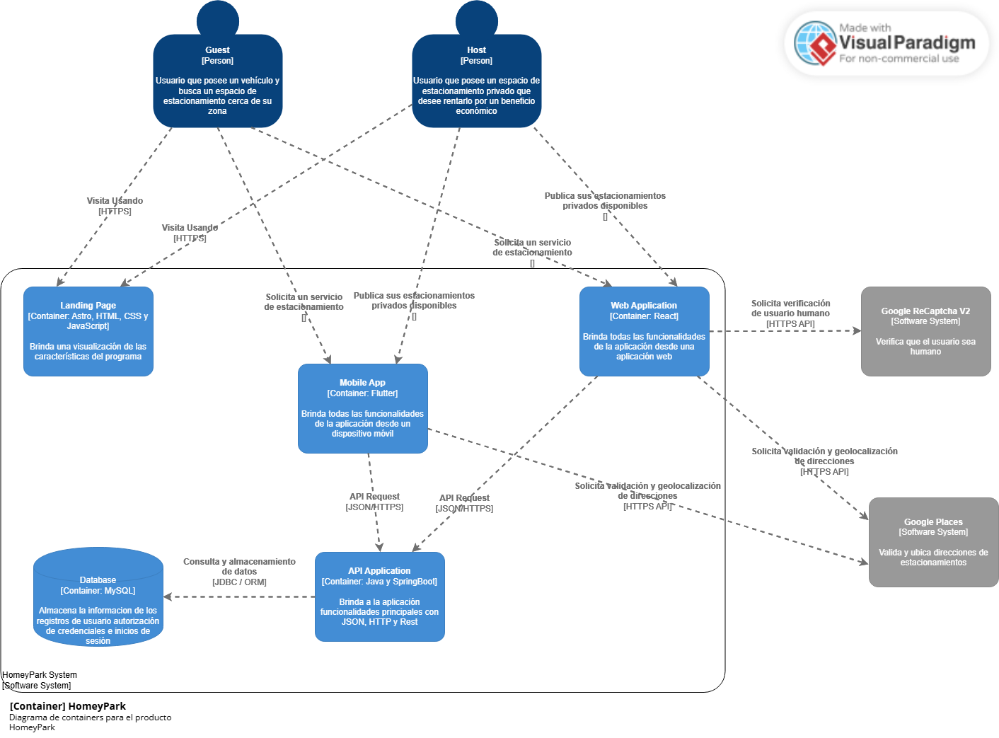
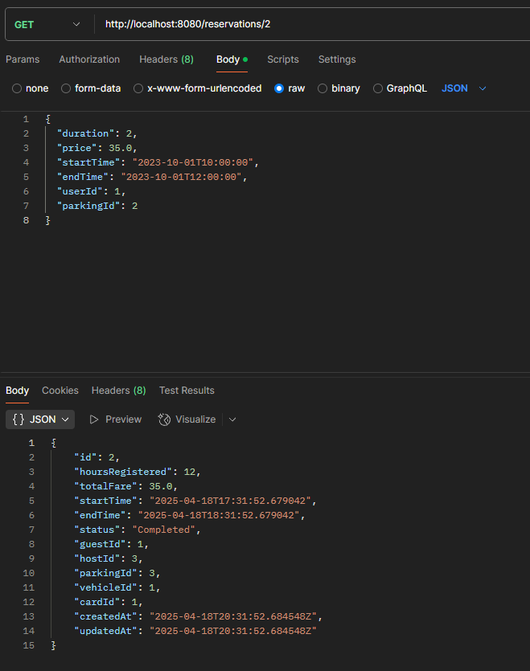

# Universidad Peruana de Ciencias Aplicadas

### INFORME DEL TRABAJO 1 (TB1)

**Curso:** Diseño de Experimentos de Ingeniería de Software

**Sección:** 1ASI0732

**Profesor:** Julio Manuel Noriega Melendez

**Carrera:** Nombre de la carrera

**Ciclo:** 2025-01

**Startup:** Netvia

**Producto:** HomeyPark

### Integrantes:

| Nombre                          | Código     |
| ------------------------------- | ---------- |
| Sebastian Cachis Gonzales       | u202210846 |
| Adriano Sebastian Cruz Palomino | u202210697 |
| Amner Levi Llamo Sanchez        | u20221c376 |
| Marcelo Fabian Garro Vega       | u20201c410 |
| Lucio Heli Yen Cerna            | u202213143 |

### Abril del 2025

### Registro de versiones del informe

| Versión | Fecha      | Autor            | Descripción                           |
| ------- | ---------- | ---------------- | ------------------------------------- |
| 1.0     | 05/04/2025 | Adriano Cruz     | Creación de la estructura del informe |
| 1.0     | 06/04/2025 | Sebastian Cachis | Desarrollo del capítulo I             |
| 1.4     | 19/04/2025 | Adriano Cruz     | Desarrollo del capítulo IV            |
| 1.2     | 06/04/2025 | Sebastian Cachis | Desarrollo del capítulo V             |

### Project Report Collaboration Insights

**TB1**  
Para el desarrollo del informe perteneciente a la entrega TB1, se dividió la implementación de secciones de la siguiente forma para cada integrante del equipo:

| Integrante              | Tareas Designadas                    |
| ----------------------- | ------------------------------------ |
| Sebastian Cachis        | Desarrollo de todo el capítulo I y V |
| [Nombre del integrante] | [Tareas]                             |
| ...                     | ...                                  |

# Tabla de Contenidos

### [Student Outcome](#outcome)

### [Capítulo I: Introducción](#capitulo-i-introduccion)

- [1.1. Startup Profile](#11-startup-profile)
  - [1.1.1. Descripción de la Startup](#111-descripción-de-la-startup)
  - [1.1.2. Perfiles de integrantes del equipo](#112-perfiles-de-integrantes-del-equipo)
- [1.2. Solution Profile](#12-solution-profile)
  - [1.2.1. Antecedentes y problemática](#121-antecedentes-y-problemática)
  - [1.2.2. Lean UX Process](#122-lean-ux-process)
    - [1.2.2.1. Lean UX Problem Statements](#1221-lean-ux-problem-statements)
    - [1.2.2.2. Lean UX Assumptions](#1222-lean-ux-assumptions)
    - [1.2.2.3. Lean UX Hypothesis Statements](#1223-lean-ux-hypothesis-statements)
    - [1.2.2.4. Lean UX Canvas](#1224-lean-ux-canvas)
- [1.3. Segmentos objetivo](#13-segmentos-objetivo)

### [Capítulo II: Requirements Elicitation & Analysis](#capitulo-ii-requirements-elicitation--analysis)

- [2.1. Competidores](#21-competidores)
  - [2.1.1. Análisis competitivo](#211-análisis-competitivo)
  - [2.1.2. Estrategias y tácticas frente a competidores](#212-estrategias-y-tácticas-frente-a-competidores)
- [2.2. Entrevistas](#22-entrevistas)
  - [2.2.1. Diseño de entrevistas](#221-diseño-de-entrevistas)
  - [2.2.2. Registro de entrevistas](#222-registro-de-entrevistas)
  - [2.2.3. Análisis de entrevistas](#223-análisis-de-entrevistas)
- [2.3. Needfinding](#23-needfinding)
  - [2.3.1. User Personas](#231-user-personas)
  - [2.3.2. User Task Matrix](#232-user-task-matrix)
  - [2.3.3. User Journey Mapping](#233-user-journey-mapping)
  - [2.3.4. Empathy Mapping](#234-empathy-mapping)
  - [2.3.5. As-is Scenario Mapping](#235-as-is-scenario-mapping)
- [2.4. Ubiquitous Language](#24-ubiquitous-language)

### [Capítulo III: Requirements Specification](#capitulo-iii-requirements-specification)

- [3.1. To-Be Scenario Mapping](#31-to-be-scenario-mapping)
- [3.2. User Stories](#32-user-stories)
- [3.3. Product Backlog](#33-product-backlog)
- [3.4. Impact Mapping](#34-impact-mapping)

### [Capítulo IV: Product Design](#capitulo-iv-product-design)

- [4.1. Style Guidelines](#41-style-guidelines)
  - [4.1.1. General Style Guidelines](#411-general-style-guidelines)
  - [4.1.2. Web Style Guidelines](#412-web-style-guidelines)
  - [4.1.3. Mobile Style Guidelines](#413-mobile-style-guidelines)
    - [4.1.3.1. iOS Mobile Style Guidelines](#4131-ios-mobile-style-guidelines)
    - [4.1.3.2. Android Mobile Style Guidelines](#4132-android-mobile-style-guidelines)
- [4.2. Information Architecture](#42-information-architecture)
  - [4.2.1. Organization Systems](#421-organization-systems)
  - [4.2.2. Labeling Systems](#422-labeling-systems)
  - [4.2.3. SEO Tags and Meta Tags](#423-seo-tags-and-meta-tags)
  - [4.2.4. Searching Systems](#424-searching-systems)
  - [4.2.5. Navigation Systems](#425-navigation-systems)
- [4.3. Landing Page UI Design](#43-landing-page-ui-design)
  - [4.3.1. Landing Page Wireframe](#431-landing-page-wireframe)
  - [4.3.2. Landing Page Mock-up](#432-landing-page-mock-up)
- [4.4. Mobile Applications UX/UI Design](#44-mobile-applications-uxui-design)
  - [4.4.1. Mobile Applications Wireframes](#441-mobile-applications-wireframes)
  - [4.4.2. Mobile Applications Wireflow Diagrams](#442-mobile-applications-wireflow-diagrams)
  - [4.4.3. Mobile Applications Mock-ups](#443-mobile-applications-mock-ups)
  - [4.4.4. Mobile Applications User Flow Diagrams](#444-mobile-applications-user-flow-diagrams)
- [4.5. Mobile Applications Prototyping](#45-mobile-applications-prototyping)
  - [4.5.1. Android Mobile Applications Prototyping](#451-android-mobile-applications-prototyping)
  - [4.5.2. iOS Mobile Applications Prototyping](#452-ios-mobile-applications-prototyping)
- [4.6. Web Applications UX/UI Design](#46-web-applications-uxui-design)
  - [4.6.1. Web Applications Wireframes](#461-web-applications-wireframes)
  - [4.6.2. Web Applications Wireflow Diagrams](#462-web-applications-wireflow-diagrams)
  - [4.6.3. Web Applications Mock-ups](#463-web-applications-mock-ups)
  - [4.6.4. Web Applications User Flow Diagrams](#464-web-applications-user-flow-diagrams)
- [4.7. Web Applications Prototyping](#47-web-applications-prototyping)
- [4.8. Domain-Driven Software Architecture](#48-domain-driven-software-architecture)
  - [4.8.1. Software Architecture Context Diagram](#481-software-architecture-context-diagram)
  - [4.8.2. Software Architecture Container Diagrams](#482-software-architecture-container-diagrams)
  - [4.8.3. Software Architecture Components Diagrams](#483-software-architecture-components-diagrams)
- [4.9. Software Object-Oriented Design](#49-software-object-oriented-design)
  - [4.9.1. Class Diagrams](#491-class-diagrams)
  - [4.9.2. Class Dictionary](#492-class-dictionary)
- [4.10. Database Design](#410-database-design)
  - [4.10.1. Relational/Non-Relational Database Diagram](#4101-relationalnon-relational-database-diagram)

### [Capítulo V: Product Implementation](#capitulo-v-product-implementation)

- [5.1. Software Configuration Management](#51-software-configuration-management)
  - [5.1.1. Software Development Environment Configuration](#511-software-development-environment-configuration)
  - [5.1.2. Source Code Management](#512-source-code-management)
  - [5.1.3. Source Code Style Guide & Conventions](#513-source-code-style-guide--conventions)
  - [5.1.4. Software Deployment Configuration](#514-software-deployment-configuration)
- [5.2. Product Implementation & Deployment](#52-product-implementation--deployment)
  - [5.2.1. Sprint Backlogs](#521-sprint-backlogs)
  - [5.2.2. Implemented Landing Page Evidence](#522-implemented-landing-page-evidence)
  - [5.2.3. Implemented Frontend-Web Application Evidence](#523-implemented-frontend-web-application-evidence)
  - [5.2.4. Implemented Native-Mobile Application Evidence](#524-implemented-native-mobile-application-evidence)
  - [5.2.5. Implemented RESTful API and/or Serverless Backend Evidence](#525-implemented-restful-api-andor-serverless-backend-evidence)
  - [5.2.6. RESTful API documentation](#526-restful-api-documentation)
  - [5.2.7. Team Collaboration Insights](#527-team-collaboration-insights)
- [5.3. Video About-the-Product](#53-video-about-the-product)

- [Conclusiones, Bibliografía y Anexos](#conclusiones-bibliografía-y-anexos)

<h1 id="outcome">Student Outcome</h1>

### Student Outcome

| Criterio específico                                                                                                                                    | Acciones Realizadas                                                                                                                                                                                                                                                                                | Conclusiones                                                                                                                                  |
| ------------------------------------------------------------------------------------------------------------------------------------------------------ | -------------------------------------------------------------------------------------------------------------------------------------------------------------------------------------------------------------------------------------------------------------------------------------------------- | --------------------------------------------------------------------------------------------------------------------------------------------- |
| Reconoce responsabilidad ética y profesional en situaciones de ingeniería de software                                                                  | Sebastian Nicolas Cachis Gonzales <b>TB1</b> Para esta entrega desarrolle el capitulo 1, hice entrevistas y tambien los diseños para la landingPage  [Nombre del integrante] <b>TB1</b> [Descripción de acciones realizadas]                                                     | <b>TB1</b>  Designamos tareas a cada integrante para optimizar el tiempo de trabajo                                                        |
| Emite juicios informados considerando el impacto de las soluciones de ingeniería de software en contextos globales, económicos, ambientales y sociales | Sebastian Nicolas Cachis Gonzales  <b>TB1</b> Esto me ha permito tener una mejor vision de los limites y objetivos de nuestro proyecto asi como conocer las inquietudes de nuestros segmentos objetvios  [Nombre del integrante] <b>TB1</b> [Descripción de acciones realizadas] | <b>TB1</b>  Hemos enfocado las habilidades de cada integrante en las areas de desarrollo que mejor dominen para una mejor linea de trabajo |

<h1 id="capitulo-i-introduccion">Capítulo I: Introducción</h1>

## 1.1. Startup Profile

### 1.1.1. Descripción de la Startup

Nuestro equipo Netvia ha sido creado con el propósito de solucionar la preocupación por la
escasez de espacios de estacionamiento en entornos urbanos. La congestión del tráfico y la ineficiente
búsqueda de estacionamientos genera una gran frustración para el conductor. HomeyPark propone
revolucionar la forma en que las personas encuentran y utilizan espacios de estacionamiento.
Desarrollaremos una aplicación que ofrecerá una interfaz intuitiva, permitiendo a los usuarios buscar,
reservar y pagar por estacionamientos de manera sencilla y rápida.

## Misión

Facilitar el intercambio equitativo de habilidades y servicios entre personas, empoderando a las comunidades para crear valor compartido sin intermediación monetaria, promoviendo así una economía colaborativa basada en el talento y las conexiones humanas.

## Visión

Ser la plataforma líder global en intercambio de servicios peer-to-peer, transformando la manera en que las personas intercambian valor, fomentando una sociedad más colaborativa donde el acceso a servicios y conocimientos no esté limitado por restricciones económicas sino potenciado por el talento colectivo de la comunidad.

### 1.1.2. Perfiles de integrantes del equipo

|                                                                                                                                                                                                                                             Descripción de los perfiles de los integrantes del equipo                                                                                                                                                                                                                                              |                                                Foto del integrante                                                |
| :------------------------------------------------------------------------------------------------------------------------------------------------------------------------------------------------------------------------------------------------------------------------------------------------------------------------------------------------------------------------------------------------------------------------------------------------------------------------------------------------------------------------------------------------: | :---------------------------------------------------------------------------------------------------------------: |
|                                                                                                                                Mi nombre es Soy un estudiante de 22 años con interés en el desarrollo web y móvil. Disfruto aprender nuevas tecnologías y colaborar en proyectos donde pueda aportar con mis conocimientos. Me motiva compartir experiencias con otros y crecer junto a mi equipo en cada desafío.                                                                                                                                 |                                                        |
|                                                                                                  Mi nombre es **Amner Levi Llamo Sánchez**, soy estudiante del séptimo ciclo de ingeniería de software en la UPC. Me gusta jugar fútbol y videojuegos, por eso estoy constantemente investigando sobre nuevas tecnologías. Soy responsable con los trabajos que se me asignan; además soy tolerante y me adapto a las circunstancias del equipo.                                                                                                   |                                   |
|                                                                                         Mi nombre es **Sebastian Nicolas Cachis Gonzales**, soy estudiante de séptimo ciclo de ingeniería de software en la UPC. Me considero una persona proactiva, organizada, meticulosa y muy enfocada en mis estudios, tanto grupales como individuales. Tengo facilidad para entender y ejemplificar los distintos temas que vemos, teniendo soltura para explicar.                                                                                          |                                                       |
|                                                                                                                               Mi nombre es **Adriano Sebastian Cruz Palomino**, tengo 20 años, soy alumno de Ingeniería de Software en la UPC, actualmente estoy cursando el 7mo ciclo. Soy una persona curiosa, responsable, y comprometida con mis estudios, siempre busco aprender más y mejorar mis habilidades.                                                                                                                               |                                                          |
| Mi nombre es **Lucio Heli Yen Cerna**, soy estudiante del séptimo ciclo de la carrera de Ingeniería de Software en la UPC. Soy una persona proactiva y organizada que se esmera en construir productos de calidad innovadores. Me apasiona mucho trabajar en equipo, debatir y compartir una misma motivación debido a que siento que aprendo de mis propios compañeros y mejoro como profesional. Por otro lado, mis hobbies son el gimnasio, la música y los videojuegos los cuáles me permiten llevar un estilo de vida balanceado y saludable. |  |

## 1.2. Solution Profile

### 1.2.1. Antecedentes y problemática

En la actualidad, la congestión vehicular ha ido en aumento debido al crecimiento constante de la
población y al incremento del uso de vehículos. Este problema se ve agravado por la ineficiencia en la
búsqueda de espacios de estacionamiento, lo que ha generado una experiencia frustrante para los
conductores a nivel mundial. A su vez, aquellos que poseen espacios de estacionamiento sin utilizar en
áreas urbanas se enfrentan al desafío de no contar con una plataforma eficaz para rentabilizar estos
recursos.

**What?**

Nuestro startup ha identificado como problemática principal la escasez de espacios de estacionamiento
en entornos urbanos y la complejidad que representa actualmente encontrar un lugar para estacionar.
Esto se debe a la elevada demanda de vehículos para las actividades cotidianas.

**When?**

Esta preocupación ha ido en aumento a lo largo del tiempo, ya que las ciudades han visto crecer su
población, lo que ha resultado en un mayor número de vehículos en circulación. En los últimos años, la
congestión del tráfico y la dificultad para encontrar estacionamiento se han vuelto problemas más
urgentes.

**Where?**

El problema se presenta principalmente en áreas urbanas densamente pobladas a nivel global, donde el
espacio es limitado y la demanda de estacionamiento es alta.

**Who?**

Los conductores son los principales afectados por este problema, ya que se enfrentan a dificultades
para encontrar estacionamientos convenientes. Además, los propietarios de espacios de
estacionamiento se ven en desventaja frente a grandes empresas del sector, lo que complica la
promoción y alquiler de sus servicios.

**Why?**

La causa principal radica en la insuficiencia de espacios de estacionamiento disponibles en áreas
urbanas, lo que intensifica la congestión vehicular y dificulta que los conductores encuentren un lugar
para estacionar en el momento oportuno.

**How?**

El problema ocurre cuando la congestión del tráfico, combinada con la falta de espacios de
estacionamiento, impide que la población pueda estacionar de manera eficiente y conveniente.

**How much?**

Este problema afecta de manera notable a Lima, la capital, donde según un estudio realizado por la
ONG Luz Ámbar en 2016, existe una carencia de aproximadamente 45,000 espacios de
estacionamiento en cinco distritos. Sin embargo, esta cifra es insuficiente en comparación con la
cantidad de vehículos en la ciudad, que alcanza aproximadamente 1 millón 800,000 unidades. Esta
discrepancia entre la cantidad de vehículos y la disponibilidad de estacionamientos contribuye
significativamente a la congestión vehicular y al desafío constante de encontrar un lugar adecuado para
estacionar.

### 1.2.2. Lean UX Process

### 1.2.2.1. Lean UX Problem Statements

El desarrollo de HomeyPark sigue la metodología Lean UX, que combina el pensamiento Lean Startup con el diseño centrado en el usuario. Este enfoque nos permite validar rápidamente nuestras hipótesis de valor y crear soluciones adaptadas a las necesidades reales de los usuarios con el mínimo de recursos.

**Problem Statement 1: Usuarios de parking**

En la actualidad, muchos ciudadanos de las zonas urbanas del Perú requieren de un vehículo
motorizado para realizar tramos largos de viaje. Debido a su alta demanda, el diario “El Comercio”
(2024) revela que el 51% de conductores de la ciudad de Lima consideran necesario incrementar la
cantidad de espacios para estacionar.

Hemos encontrado que los conductores presentan dificultades para encontrar espacios de
estacionamiento disponibles, tomando un aproximado de 10 horas totales al mes para conseguir uno.

¿Cómo podemos buscar o proporcionar más espacios de estacionamiento para los usuarios de forma
eficiente y rápida para sus vehículos motorizados?

**Problem Statement 2: Anfitriones**

Nuestra aplicación permitirá a los usuarios poder promocionar sus garajes para obtener una fuente de
ingresos adicional sin interrupción en sus actividades del día a día. Esto favorecerá a las comunidades
para la reducción de la congestión vehicular.

Hemos encontrado que muchos propietarios no están dispuestos a ofrecer su garaje en alquiler debido
al anonimato de los clientes, lo cual genera una sensación de inseguridad en estas entidades.

¿Cómo podemos implementar un sistema de seguridad que vele por la integridad, bienes y bienes
inmobiliarios de nuestros usuarios de la aplicación?

### 1.2.2.2. Lean UX Assumptions

**Business Assumptions**

1. Creo que mis usuarios necesitan una mejor opción de encontrar estacionamientos y, de ser
   posible, reservarlos.

2. Estas necesidades se pueden resolver con una aplicación móvil que les permita a los
   conductores reservar en los garajes de la ciudad, debido a que la mayoría del tiempo se
   encuentran disponibles.

3. Mis clientes iniciales son las personas que cuenten con un vehículo y que tengan dificultades
   de encontrar algún estacionamiento disponible.

4. El valor #1 que el cliente requiere de mi servicio es encontrar y reservar espacios para
   estacionar en un corto periodo de tiempo de forma segura.

5. Voy a adquirir a mis clientes a través de estrategias de marketing en diversas redes sociales,
   mostrando todos los beneficios que da nuestra aplicación móvil.

6. Mi competencia en el mercado serán las empresas que se dedican a ofrecer sus servicios de
   estacionamiento.

7. Los venceremos debido a que ofrecemos a los usuarios poder generar ingresos de manera
   pasiva al rentar sus garajes como estacionamiento.

8. Mis mayores riesgos del producto es no encontrar una manera de brindar seguridad a los
   conductores como a los propietarios de los garajes.

9. Resolveremos esto con la incorporación de un sistema que se encargue de validar los
   parámetros de seguridad de los conductores y los garajes en alquiler para ofrecer una mejor
   seguridad al público.

**User Assumptions**

_Usuarios de parking_

**¿Quién es el usuario?** Conductores que en su día a día necesitan encontrar estacionamiento para sus
vehículos.

**¿Dónde encaja nuestro servicio?** Nuestro servicio encaja tanto para su trabajo como para sus
actividades diarias.

**¿Qué problema tiene nuestro servicio y cómo se resuelve?** El problema es sobre la posible
inseguridad del usuario al alquilar en una cochera de cualquier persona desconocida. Se puede resolver
mediante un sistema de filtros que garanticen al usuario la seguridad de la cochera y contar con bases
legales para la publicación del producto.

**¿Cuándo y cómo es usado nuestro producto?** Nuestro producto será usado mayormente cuando el
usuario necesite encontrar algún estacionamiento para realizar cualquier actividad. La aplicación móvil
se podrá usar como un sistema de búsqueda y reserva de cocheras.

_Anfitriones_

**¿Quién es el usuario?** Personas con garajes que desean poner en alquiler para generar ingresos.

**¿Dónde encaja nuestro servicio?** Nuestro servicio encaja en su vida porque pueden poner en alquiler
sus garajes mientras realizan cualquier actividad.

**¿Qué problema tiene nuestro servicio y cómo se resuelve?** El problema será el proceso para poder
registrar sus cocheras, debido a que puede llegar a ser confuso o tedioso para el anfitrión. Lo podemos
resolver mediante capacitación sobre el proceso de filtros para facilitar al usuario el registro.

**¿Cuándo y cómo es usado nuestro producto?** Nuestra aplicación es usada principalmente cuando el
anfitrión dispone de cualquier garaje disponible que desee poner en alquiler para generar ingresos.
Nuestro producto es usado como un gestor de cocheras sobre reservas, estados, recibos, etc.

### 1.2.2.3. Lean UX Hypothesis Statements

1. Creemos que la función de reservar cocheras facilitará al usuario conseguir un espacio para
   estacionamiento. Sabremos que tendremos éxito cuando la mayoría de los usuarios demoren
   en conseguir estacionamiento en un plazo máximo de 5 minutos.

2. Creemos que la implementación del mapa de Google Maps permitirá al usuario una mejor
   búsqueda de cocheras. Sabremos que estaremos en lo cierto cuando el 100% de nuestros
   usuarios no presentan dificultades para encontrar cocheras.

3. Creemos que proporcionar al usuario registrar sus cocheras aumentará la cantidad de
   estacionamientos. Sabremos que estaremos en lo cierto cuando el índice de escasez de
   estacionamientos se reduzca en un 20%.

4. Creemos que implementar un sistema de notificaciones alertará a los usuarios sobre la
   disponibilidad de las cocheras. Sabremos que tendremos éxito cuando al menos el 80% de los
   usuarios aprovechen estas alertas para asegurar un espacio de estacionamiento.

### 1.2.2.4. Lean UX Canvas

## 1.3. Segmentos objetivo

Nuestro segmento objetivo está compuesto por dos usuarios:

**Usuarios de parking:** Persona que busca alguna solución para su necesidad que es buscar un
estacionamiento en entornos urbanos para su vehículo

**Anfitrión:** Propietario de una vivienda que cuente con una cochera privada que busque sacar
provecho de forma efectiva.

<h1 id="capitulo-ii-requirements-elicitation--analysis">Capítulo II: Requirements Elicitation & Analysis</h1>

## 2.1. Competidores

### 2.1.1. Análisis competitivo

Nuestros competidores principalmente vendrían a ser otras aplicaciones que se encargan del servicio
de estacionamiento por celular. Algunos de nuestros competidores potenciales vendrían a ser:

1. EasyPark: Es una app popular que permite a los usuarios encontrar y pagar por
   estacionamientos en diversas ciudades. EasyPark se integra con sistemas de estacionamiento
   inteligente, ofreciendo información en tiempo real sobre la disponibilidad de espacios, y cuenta
   con opciones de pago automatizado y reconocimiento de placas. La app también permite
   reservar espacios con anticipación y está disponible en varios países, facilitando la movilidad
   urbana a nivel internacional.

2. Parkopedia: Esta aplicación ofrece una amplia base de datos de estacionamientos, incluyendo
   garajes privados y públicos. Parkopedia también proporciona predicciones sobre la
   disponibilidad de espacios y se integra con sistemas de navegación en vehículos. Además,
   ofrece información detallada sobre tarifas y horarios, lo que ayuda a los usuarios a tomar
   decisiones más informadas al buscar estacionamiento. Su cobertura incluye más de 15,000
   ciudades en todo el mundo.

3. Wayleadr: Se centra en la optimización de espacios de estacionamiento en áreas urbanas y
   corporativas. Ofrece características como reservas anticipadas y gestión de estacionamiento
   para empresas, utilizando geolocalización para mejorar la eficiencia. También permite a las
   empresas monitorear y gestionar sus plazas de estacionamiento, reduciendo costos operativos y
   mejorando la experiencia de los empleados. Wayleadr ha sido adoptada por importantes
   corporaciones globales para optimizar el uso de sus instalaciones.

### 2.1.2. Estrategias y tácticas frente a competidores

<table> <tr> <th colspan="6" valign="top">Competitive Analysis Landscape</th> </tr> <tr> <td colspan="2" valign="top">¿Por qué llevar a cabo este análisis?</td> <td colspan="4" valign="top">Un análisis competitivo ayuda a identificar oportunidades y mejorar su propuesta de valor para mantenerse relevante en el mercado.</td> </tr> <tr> <td colspan="2" valign="top"></td> <td valign="top">HomeyPark</td> <td valign="top">EasyPark</td> <td valign="top">Parkopedia</td> <td valign="top">Wayleadr</td> </tr> <tr> <td rowspan="2" valign="top">Perfil</td> <td valign="top">Overview</td> <td valign="top">Una aplicación que conecta conductores con garajes privados disponibles, permitiéndoles reservar espacios de estacionamiento fácilmente. </td> <td valign="top">Una app popular que ayuda a encontrar, reservar y pagar estacionamientos fácilmente. </td> <td valign="top">Una base de datos global que ofrece información detallada sobre estacionamientos y disponibilidad.</td> <td valign="top">Una solución para optimizar y gestionar estacionamientos en entornos corporativos y urbanos.</td> </tr> <tr> <td valign="top">Ventaja competitiva ¿Qué valor ofrece a los clientes?</td> <td valign="top">Ofrece a los conductores la posibilidad de encontrar y reservar estacionamientos en garajes privados en tiempo real, reduciendo la congestión vehicular y proporcionando una fuente de ingresosadicional para los propietarios de garajes.</td> <td valign="top">Ofrece a los usuarios una experiencia sin fricciones para encontrar, reservar y pagar por estacionamientos, todo a través de una integración avanzada con sistemas de navegación y pagos automatizados.</td> <td valign="top">Proporciona a los usuarios información completa y en tiempo real sobre disponibilidad y tarifas de estacionamiento en miles de ciudades, ayudándolos a tomar decisiones informadas rápidamente.</td> <td valign="top">Facilita la gestión eficiente de espacios de estacionamiento en entornos corporativos, mejorando la experiencia del usuario y optimizando los recursos de las empresas.</td> </tr> <tr> <td rowspan="2" valign="top">Perfil de Marketing</td> <td valign="top">Mercado objetivo</td> <td valign="top">Conductores  Propietarios de garajes</td> <td valign="top"> 
Conductores urbanos  Viajeros frecuentes</td> <td valign="top">Conductores  Empresas de navegación vehicular </td> <td valign="top">Empresas con estacionamientos  Corporaciones </td> </tr> <tr> <td valign="top">Estrategias de marketing</td> <td valign="top">Marketing en redes sociales, marketing de contenido</td> <td valign="top">Marketing en redes sociales, marketing de contenido</td> <td valign="top">Marketing en redes sociales, marketing de contenido</td> <td valign="top">Marketing en redes sociales, marketing de contenido</td> </tr> <tr> <td rowspan="3" valign="top">Perfil de Producto</td> <td valign="top">Productos & Servicios</td> <td valign="top">Reserva de garajes a través de la app, integración con Google Maps para la localización de espacios, y un sistema de seguridad para transacciones.</td> <td valign="top">App de reserva de estacionamiento, pagos automatizados, y notificaciones de disponibilidad en tiempo real.</td> <td valign="top">Base de datos de estacionamientos, predicciones de disponibilidad, e integración con sistemas de navegación.</td> <td valign="top">Gestión de estacionamientos corporativos, reservas anticipadas, y análisis de uso de espacios.</td> </tr> <tr> <td valign="top">Precios & Costos</td> <td valign="top">El precio varía según el servicio que adquiere el usuario.</td> <td valign="top">El precio varía según el servicio que adquiere el usuario.</td> <td valign="top">El precio varía según el servicio que adquiere el usuario.</td> <td valign="top">El precio varía según el servicio que adquiere el usuario.</td> </tr> <tr> <td valign="top">Canales de distribución (Web y/o Móvil)</td> <td valign="top">Aplicación móvil y web.</td> <td valign="top">Aplicación móvil y web.</td> <td valign="top">Aplicación móvil y web.</td> <td valign="top">Aplicación móvil y web.</td> </tr> <tr> <td rowspan="4" valign="top">Análisis SWOT</td> <td valign="top">Fortalezas</td> <td valign="top">Proporciona una solución innovadora parala falta de estacionamientos en áreas urbanas al aprovechar los garajes privados, lo que también beneficia a las comunidades locales.</td> <td valign="top">Amplia adopción y fácil integración con sistemas de pago y navegación, lo que facilita su uso en diversas ciudades.</td> <td valign="top">Ofrece la base de datos de estacionamientos más extensa y detallada a nivel global, con información en tiempo real.</td> <td valign="top">Especialización en la optimización de estacionamientos corporativos, lo que mejora la eficiencia y reduce costos para empresas.</td> </tr> <tr> <td valign="top">Debilidades</td> <td valign="top">La seguridad tanto para los conductores como para los propietarios de garajes puede ser una preocupación, lo que podría afectar la adopción.</td> <td valign="top">Puede enfrentar dificultades en regiones donde la infraestructura de estacionamiento inteligente es limitada.</td> <td valign="top">Su dependencia de datos de terceros puede afectar la precisión y actualización de la información. </td> <td valign="top">Está más centrada en mercados corporativos, lo que limita su alcance para el usuario promedio.</td> </tr> <tr> <td valign="top">Oportunidades</td> <td valign="top">Expansión a nuevas ciudades y la posibilidad de integrar tecnologías avanzadas de seguridad y autenticación para aumentar la confianza de los usuarios.</td> <td valign="top">Expandir su servicio a más ciudades y regiones que aún no cuentan con soluciones avanzadas de estacionamiento.</td> <td valign="top">Integrar tecnologías avanzadas como inteligencia artificial para mejorar la precisión de las predicciones de disponibilidad de estacionamiento.</td> <td valign="top">Ampliar su oferta para incluir soluciones de estacionamiento para pequeños negocios y complejos residenciales.</td> </tr> <tr> <td valign="top">Amenazas</td> <td valign="top">Competencia de aplicaciones similares que podrían ofrecer características de seguridad o precios más competitivos, así como la posible resistencia de los usuarios a confiar en garajes privados.</td> <td valign="top">La creciente competencia de nuevas aplicaciones de estacionamiento con funcionalidades más avanzadas podría reducir su cuota de mercado.</td> <td valign="top">Los cambios en las regulaciones de datos y privacidad pueden limitar el acceso a la información necesaria para mantener su base de datos actualizada.</td> <td valign="top">La dependencia de un nicho específico como el mercado corporativo puede limitar su crecimiento frente a soluciones más generalistas.</td> </tr> </table>

## 2.2. Entrevistas

### 2.2.1. Diseño de entrevistas

Para obtener una comprensión profunda de las necesidades y expectativas de los usuarios potenciales de HomeyPark, se diseñarán entrevistas estructuradas con preguntas específicas para diferentes segmentos de usuarios. A continuación, se presentan las preguntas para cada grupo:

**Preguntas Generales**

- ¿Cuál es su nombre y apellido completo?
- ¿Cuál es su edad?
- ¿En qué distrito o lugar reside?
- ¿Cuál es su ocupación?

**Preguntas para el usuario de Parking**

- ¿Con qué tipo de vehículo dispone? ¿Carro ligero, camioneta o moto?
- ¿Con qué frecuencia usa su(s) vehículo(s)?
- Hoy en día, es complicado encontrar un estacionamiento disponible. ¿Cuál cree que es la razón por la que sucede esto?
- ¿Cuáles serían las horas donde es más difícil encontrar estacionamientos?
- ¿Cuánto tiempo demora aproximadamente en encontrar estacionamiento?
- ¿Estaría dispuesto a usar como estacionamiento los garajes de las viviendas? ¿Cuáles serían sus motivos?
- ¿Cuáles serían los requisitos mínimos para asegurar la integridad del usuario y su vehículo?
- Si este servicio llega a ser seguro para sus clientes, ¿cree que sería útil para los ciudadanos de las zonas urbanas del Perú? ¿En que los beneficiaría?
- ¿Confiaría usted en una aplicación móvil que facilite la búsqueda de estos tipos de estacionamientos?

**Preguntas para el anfitrión o host**

- ¿Con cuántos garajes o cocheras cuenta en su hogar?
- ¿Cuál es el tamaño promedio de los garajes en su hogar?
- ¿En qué momentos de su día a día sus garajes se encuentran desocupados?
- ¿Cuenta con algún sistema de seguridad en su cochera?
- ¿Ha llegado a considerar la posibilidad de alquilar sus garajes en algún momento? ¿Por qué?
- ¿Cuáles serían los requisitos mínimos para asegurar la integridad del usuario y su bienes, ya sea inmobiliario o no?
- ¿Le interesaría tener una aplicación móvil que permita promocionar sus garajes como estacionamiento y generar ingresos, sin interrumpir sus actividades diarias?

### 2.2.2. Registro de entrevistas

**_Usuarios de parking_**

<table>
  <tr>
    <th colspan="2" valign="top">Registro de entrevistas</th>
  </tr>
  <tr>
    <td valign="top"><b>Nombre entrevistado</b></td>
    <td valign="top">Walther Cachay</td>
  </tr>
  <tr>
    <td valign="top"><b>Edad</b></td>
    <td valign="top">25 años</td>
  </tr>
  <tr>
    <td valign="top"><b>Departamento</b></td>
    <td valign="top">Lima, Perú</td>
  </tr>
  <tr>
    <td valign="top"><b></b></td>
    <td valign="top">
      Walter Cachay, un estudiante de ingeniería mecatrónica de 25 años, enfrenta dificultades diarias para encontrar estacionamiento con su auto en Lima, especialmente en horas punta, llegando a tardar hasta una hora y media en zonas como Surco o cerca de su universidad, e incluso una o dos horas en el centro, una situación que atribuye al aumento del parque automotor. Aunque reacio inicialmente a usar garajes de viviendas por seguridad y comodidad, consideraría esta opción si existieran garantías como comprobantes de empresa, reglas claras y vigilancia 24/7. Walter ve una aplicación para buscar estacionamiento como un avance muy positivo para ahorrar tiempo, combustible y encontrar lugares disponibles de manera eficiente, siempre y cuando garantice la seguridad del vehículo mediante un sistema de recomendaciones y ubicaciones confiables.
    </td>
  </tr>
  <tr>
    <td valign="top">Duración entrevista  00:00-06:00</td>
    <td valign="top"><a href="https://upcedupe-my.sharepoint.com/:v:/g/personal/u20221c376_upc_edu_pe/EUWwVDeGIMxOirf7aLw_VKoBfkh-Q-X3iBSyjW7t8n4CoA?e=czxNW6" target="_blank">https://upcedupe-my.sharepoint.com/:v:/g/personal/u20221c376_upc_edu_pe/EUWwVDeGIMxOirf7aLw_VKoBfkh-Q-X3iBSyjW7t8n4CoA?e=czxNW6</a></td>
  </tr>
  <tr>
    <td valign="top"><b>Nombre entrevistado</b></td>
    <td valign="top">Augusto Granados</td>
  </tr>
  <tr>
    <td valign="top"><b>Edad</b></td>
    <td valign="top">20 años</td>
  </tr>
  <tr>
    <td valign="top"><b>Departamento</b></td>
    <td valign="top">Lima Magdalena</td>
  </tr>
  <tr>
    <td valign="top"><b></b></td>
    <td valign="top">
      DescripcAugusto Granados es un joven que cuentan con un carro, pero se le dificulta la posibilidad de encontrar espacio donde puede dejarlo en lugares por los que transita, no comenta que puede tener ocasiones en las que no logra encontrar uno hasta por casi 20 minutos, siento esto una gran pérdida de tiempo para él. El contar con una aplicación que le permita saber en qué lugares cercanos a donde el este le sería de gran ayuda. Otro aspecto para destacar fue que menciono el que poder valorar estos espacios y conocer sus tamaños serian cruciales para el usuario que busca reservar uno de esos espacios. ayuda a que lo poseedores de un parqueo se hagan de una buena reputación y la gente pueda confiar en que puede dejar ahí sus vehículos.ión
    </td>
  </tr>
  <tr>
    <td valign="top">Duración entrevista  00:00-08:57</td>
    <td valign="top"> <a href="https://upcedupe-my.sharepoint.com/:v:/g/personal/u202210846_upc_edu_pe/EfwuXreiPk9Ak-akWrpZIvUBYeZe630_bahsL-sYD3QmHw?nav=eyJyZWZlcnJhbEluZm8iOnsicmVmZXJyYWxBcHAiOiJTdHJlYW1XZWJBcHAiLCJyZWZlcnJhbFZpZXciOiJTaGFyZURpYWxvZy1MaW5rIiwicmVmZXJyYWxBcHBQbGF0Zm9ybSI6IldlYiIsInJlZmVycmFsTW9kZSI6InZpZXcifX0%3D&e=KgTQuh " target="_blank">https://upcedupe-my.sharepoint.com/:v:/g/personal/u202210846_upc_edu_pe/EfwuXreiPk9Ak-akWrpZIvUBYeZe630_bahsL-sYD3QmHw?nav=eyJyZWZlcnJhbEluZm8iOnsicmVmZXJyYWxBcHAiOiJTdHJlYW1XZWJBcHAiLCJyZWZlcnJhbFZpZXciOiJTaGFyZURpYWxvZy1MaW5rIiwicmVmZXJyYWxBcHBQbGF0Zm9ybSI6IldlYiIsInJlZmVycmFsTW9kZSI6InZpZXcifX0%3D&e=KgTQuh </a></td>
  </tr>
  <tr>
    <td valign="top"><b>Nombre entrevistado</b></td>
    <td valign="top">Edu Arturo Antayhua</td>
  </tr>
  <tr>
    <td valign="top"><b>Edad</b></td>
    <td valign="top">23 años</td>
  </tr>
  <tr>
    <td valign="top"><b>Departamento</b></td>
    <td valign="top">Lima, San Miguel</td>
  </tr>
  <tr>
    <td valign="top"><b></b></td>
    <td valign="top">
      El entrevistado usa su vehículo con frecuencia y enfrenta dificultades para encontrar estacionamiento, especialmente en horas pico. Señala que la congestión vehicular en Lima es un factor clave y que puede tardar hasta 25 minutos en hallar un espacio. Ve con buenos ojos la idea de una app web o móvil que permita alquilar cocheras de viviendas, siempre que garantice seguridad. Considera que esta solución sería útil para zonas urbanas, al ofrecer alternativas más accesibles, cercanas y seguras.
    </td>
  </tr>
  <tr>
    <td valign="top">Duración entrevista  00:00-06:03</td>
    <td valign="top"><a href="https://upcedupe-my.sharepoint.com/:v:/g/personal/u20201c410_upc_edu_pe/ESsNFhchBGJJqJu8VPApO6UB7R50E2SeGOZJGMEkrbMSbw?e=fLfDyf&nav=eyJyZWZlcnJhbEluZm8iOnsicmVmZXJyYWxBcHAiOiJTdHJlYW1XZWJBcHAiLCJyZWZlcnJhbFZpZXciOiJTaGFyZURpYWxvZy1MaW5rIiwicmVmZXJyYWxBcHBQbGF0Zm9ybSI6IldlYiIsInJlZmVycmFsTW9kZSI6InZpZXcifX0%3D">entrevista-edu.mp4</td>
  </tr>
  <tr>
    <td valign="top"><b>Nombre entrevistado</b></td>
    <td valign="top">Fabrizio Buleje</td>
  </tr>
  <tr>
    <td valign="top"><b>Edad</b></td>
    <td valign="top">20 años</td>
  </tr>
  <tr>
    <td valign="top"><b>Departamento</b></td>
    <td valign="top">Santiago de Surco</td>
  </tr>
  <tr>
    <td valign="top"><b></b></td>
    <td valign="top">
      Descripción  
      Fabrizio Buleje Alfaro, de 20 años, vive en Surco y estudia Medicina en la Universidad Científica del Sur. Aunque tiene una moto, actualmente se transporta en su auto ligero, principalmente para ir a la universidad. Comenta que el tráfico en Lima y la dificultad para encontrar estacionamiento, especialmente en zonas céntricas como el Centro Cívico, son desafíos frecuentes. Está dispuesto a alquilar garajes de viviendas si le ofrecen seguridad y confianza. Además, considera útil una aplicación móvil que facilite la búsqueda de estacionamientos seguros y actualizados.
    </td>
  </tr>
  <tr>
    <td valign="top">Duración entrevista  00:00-07:50</td>
    <td valign="top"><a href="https://upcedupe-my.sharepoint.com/:v:/g/personal/u202210697_upc_edu_pe/ETqMzVRTXmNJoKJiOZrbD3cB8QXeMq1xaryOh3PwfP0aRQ?e=OICOHn&nav=eyJyZWZlcnJhbEluZm8iOnsicmVmZXJyYWxBcHAiOiJTdHJlYW1XZWJBcHAiLCJyZWZlcnJhbFZpZXciOiJTaGFyZURpYWxvZy1MaW5rIiwicmVmZXJyYWxBcHBQbGF0Zm9ybSI6IldlYiIsInJlZmVycmFsTW9kZSI6InZpZXcifX0%3D">
        https://upcedupe-my.sharepoint.com/:v:/g/personal/u202210697_upc_edu_pe/ETqMzVRTXmNJoKJiOZrbD3cB8QXeMq1xaryOh3PwfP0aRQ?e=OICOHn&nav=eyJyZWZlcnJhbEluZm8iOnsicmVmZXJyYWxBcHAiOiJTdHJlYW1XZWJBcHAiLCJyZWZlcnJhbFZpZXciOiJTaGFyZURpYWxvZy1MaW5rIiwicmVmZXJyYWxBcHBQbGF0Zm9ybSI6IldlYiIsInJlZmVycmFsTW9kZSI6InZpZXcifX0%3D</a>
    </td>
  </tr>
  <tr>
    <td valign="top">Duración entrevista  00:00-08:15</td>
    <td valign="top"> URL: []</td>
  </tr>
  <tr>
    <td valign="top"><b>Nombre entrevistado</b></td>
    <td valign="top">Nombre</td>
  </tr>
  <tr>
    <td valign="top"><b>Edad</b></td>
    <td valign="top">edad años</td>
  </tr>
  <tr>
    <td valign="top"><b>Departamento</b></td>
    <td valign="top">....</td>
  </tr>
  <tr>
    <td valign="top"><b></b></td>
    <td valign="top">
      Descripción
    </td>
  </tr>
  <tr>
    <td valign="top">Duración entrevista  00:00-08:15</td>
    <td valign="top"> URL: []</td>
  </tr>
</table>

**_Anfitriones_**

<table>
  <tr>
    <th colspan="2" valign="top">Registro de entrevistas</th>
  </tr>
  <tr>
    <td valign="top"><b>Nombre entrevistado</b></td>
    <td valign="top">Henry Sanchez</td>
  </tr>
  <tr>
    <td valign="top"><b>Edad</b></td>
    <td valign="top">36 años</td>
  </tr>
  <tr>
    <td valign="top"><b>Departamento</b></td>
    <td valign="top">Lima, Perú</td>
  </tr>
  <tr>
    <td valign="top"><b></b></td>
    <td valign="top">
      Henry Sánchez, un psicólogo de 36 años residente en San Isidro, posee dos espacios de estacionamiento en su cochera, uno de los cuales, de aproximadamente 2.5m x 5m, permanece desocupado la mayor parte del tiempo. Reconociendo la dificultad para encontrar estacionamiento en su zona, Henry ha considerado alquilar este espacio infrautilizado, pero la falta de un sistema de gestión fiable lo ha frenado. Para sentirse seguro al alquilarlo, Henry requeriría verificación de identidad y del vehículo, un sistema de calificaciones, alguna forma de garantía o seguro, términos claros, y como medida adicional, antecedentes del usuario. Muestra gran interés en una aplicación como HomeyPark que le permita monetizar este espacio de manera eficiente, segura y sin complicaciones, optimizando sus recursos y generando ingresos pasivos, y está interesado en explorar más a fondo esta oportunidad.
    </td>
  </tr>
  <tr>
    <td valign="top">Duración entrevista  00:00-05:00</td>
    <td valign="top"><a href="https://upcedupe-my.sharepoint.com/:v:/g/personal/u20221c376_upc_edu_pe/EW40jWzkorhErF8MoKSIyEIBy-fT5CM8i_D9YgqGIxFeOA?e=g8VpYy" target="_blank">https://upcedupe-my.sharepoint.com/:v:/g/personal/u20221c376_upc_edu_pe/EW40jWzkorhErF8MoKSIyEIBy-fT5CM8i_D9YgqGIxFeOA?e=g8VpYy</a></td>
  </tr>
  <tr>
    <td valign="top"><b>Nombre entrevistado</b></td>
    <td valign="top">Carla Cachis Gonzales</td>
  </tr>
  <tr>
    <td valign="top"><b>Edad</b></td>
    <td valign="top">27 años</td>
  </tr>
  <tr>
    <td valign="top"><b>Departamento</b></td>
    <td valign="top">Lima Magdalena</td>
  </tr>
  <tr>
    <td valign="top"><b></b></td>
    <td valign="top">
      Carla Cachis es una señorita que cuenta con una propiedad con estacionamiento, pero no con un carro propio, por lo que durante la semana suele estar vacío, he incluso época que no lo usa prolongadamente. Tras contarle la propuesta de HomeyPark le pareció una idea muy buena para poder contar con ingreso extra de los que ya posee sería muy útil, además que como el estacionamiento no da acceso a su hogar no estaría poniéndose en riesgo. Algo de lo que hizo mucho énfasis fue que el usuario que buscar dejar su vehículo tiene que dejar documentación oficial que valide quien es la persona, posibles antecedentes, documentos del carro a dejar y cualquier tipo de información que asegure que este conductor no presenta ser un problema.
    </td>
  </tr>
  <tr>
    <td valign="top">Duración entrevista  00:00-09:13</td>
    <td valign="top"><a href="https://upcedupe-my.sharepoint.com/:v:/g/personal/u202210846_upc_edu_pe/ERvpgREHqulEm_px0TzKo0ABE-aAytpTQTglcoAfuuhAJQ?nav=eyJyZWZlcnJhbEluZm8iOnsicmVmZXJyYWxBcHAiOiJTdHJlYW1XZWJBcHAiLCJyZWZlcnJhbFZpZXciOiJTaGFyZURpYWxvZy1MaW5rIiwicmVmZXJyYWxBcHBQbGF0Zm9ybSI6IldlYiIsInJlZmVycmFsTW9kZSI6InZpZXcifX0%3D&e=Bfzr78 Entrevista N°5: https://upcedupe-my.sharepoint.com/:v:/g/personal/u20221c376_upc_edu_pe/EbiUMHvfuqtNu7hVWBK2HD8BNYoY4tEjRtNIN3tiEoemmw?e=LvikLJ" target="_blank">https://upcedupe-my.sharepoint.com/:v:/g/personal/u202210846_upc_edu_pe/ERvpgREHqulEm_px0TzKo0ABE-aAytpTQTglcoAfuuhAJQ?nav=eyJyZWZlcnJhbEluZm8iOnsicmVmZXJyYWxBcHAiOiJTdHJlYW1XZWJBcHAiLCJyZWZlcnJhbFZpZXciOiJTaGFyZURpYWxvZy1MaW5rIiwicmVmZXJyYWxBcHBQbGF0Zm9ybSI6IldlYiIsInJlZmVycmFsTW9kZSI6InZpZXcifX0%3D&e=Bfzr78 Entrevista N°5: https://upcedupe-my.sharepoint.com/:v:/g/personal/u20221c376_upc_edu_pe/EbiUMHvfuqtNu7hVWBK2HD8BNYoY4tEjRtNIN3tiEoemmw?e=LvikLJ</a></td>
  </tr>
  <tr>
    <td valign="top"><b>Nombre entrevistado</b></td>
    <td valign="top">Rodrigo Tornero Loayza</td>
  </tr>
  <tr>
    <td valign="top"><b>Edad</b></td>
    <td valign="top">21 años</td>
  </tr>
  <tr>
    <td valign="top"><b>Departamento</b></td>
    <td valign="top">Lima, Surco</td>
  </tr>
  <tr>
    <td valign="top"><b></b></td>
    <td valign="top">
      El entrevistado dispone de un garaje con espacio para un vehículo y ocasionalmente una motocicleta, el cual permanece desocupado por períodos interdiarios de aproximadamente cinco horas. Está dispuesto a alquilarlo para generar ingresos pasivos, siempre que se garantice la seguridad del inmueble y se proporcione información confiable sobre los arrendatarios. Considera atractiva la idea de una app móvil que le permita ofrecer su cochera como espacio de estacionamiento y ve en ello una forma práctica de aprovechar un recurso infrautilizado.
    </td>
  </tr>
  <tr>
    <td valign="top">Duración entrevista  00:00-04:35</td>
    <td valign="top"> <a href="https://upcedupe-my.sharepoint.com/:v:/g/personal/u20201c410_upc_edu_pe/EeNCp6L8z-lImzB639EyMAwBXkGAeM2qeStolzxVp8vOhw?e=KLsbWk&nav=eyJyZWZlcnJhbEluZm8iOnsicmVmZXJyYWxBcHAiOiJTdHJlYW1XZWJBcHAiLCJyZWZlcnJhbFZpZXciOiJTaGFyZURpYWxvZy1MaW5rIiwicmVmZXJyYWxBcHBQbGF0Zm9ybSI6IldlYiIsInJlZmVycmFsTW9kZSI6InZpZXcifX0%3D">entrevista-rodrigo.mp4</a></td>
  </tr>
  <tr>
    <td valign="top"><b>Nombre entrevistado</b></td>
    <td valign="top">Carla Cruz</td>
  </tr>
  <tr>
    <td valign="top"><b>Edad</b></td>
    <td valign="top">30 años</td>
  </tr>
  <tr>
    <td valign="top"><b>Departamento</b></td>
    <td valign="top">Cusco, Cusco</td>
  </tr>
  <tr>
    <td valign="top"><b></b></td>
    <td valign="top">
      Descripción
      Carla Jackdel Cruz Palomino, de 30 años, vive en Cusco en un edificio con cocheras por departamento. Cuenta con dos cocheras: una pequeña para autos estándar y otra más grande para camionetas. Actualmente no posee vehículo, por lo que sus cocheras suelen estar desocupadas y a veces las presta a vecinos o amistades. Los garajes tienen cámaras de seguridad y alarmas.
      Aunque no ha alquilado formalmente sus cocheras por falta de tiempo, considera que sería una buena fuente de ingreso adicional. Señala que para hacerlo se necesitaría información detallada del usuario y respeto por las normas del edificio. Finalmente, Carla estaría interesada en una aplicación móvil que le permita alquilar sus cocheras de forma práctica y sin afectar sus actividades diarias.
    </td>
  </tr>
  <tr>
    <td valign="top">Duración entrevista  00:00-04:56</td>
    <td valign="top"><a href="https://upcedupe-my.sharepoint.com/:v:/g/personal/u202210697_upc_edu_pe/EVkwUQwS6yRCudGFUP9lYkYBdD-sjfGGK55ZiScS9zMmfg?e=AGO7Kq&nav=eyJyZWZlcnJhbEluZm8iOnsicmVmZXJyYWxBcHAiOiJTdHJlYW1XZWJBcHAiLCJyZWZlcnJhbFZpZXciOiJTaGFyZURpYWxvZy1MaW5rIiwicmVmZXJyYWxBcHBQbGF0Zm9ybSI6IldlYiIsInJlZmVycmFsTW9kZSI6InZpZXcifX0%3D">https://upcedupe-my.sharepoint.com/:v:/g/personal/u202210697_upc_edu_pe/EVkwUQwS6yRCudGFUP9lYkYBdD-sjfGGK55ZiScS9zMmfg?e=AGO7Kq&nav=eyJyZWZlcnJhbEluZm8iOnsicmVmZXJyYWxBcHAiOiJTdHJlYW1XZWJBcHAiLCJyZWZlcnJhbFZpZXciOiJTaGFyZURpYWxvZy1MaW5rIiwicmVmZXJyYWxBcHBQbGF0Zm9ybSI6IldlYiIsInJlZmVycmFsTW9kZSI6InZpZXcifX0%3D</a></td>
  </tr>
  <tr>
    <td valign="top">Duración entrevista  00:00-08:15</td>
    <td valign="top"> URL: []</td>
  </tr>
  <tr>
    <td valign="top"><b>Nombre entrevistado</b></td>
    <td valign="top">Nombre</td>
  </tr>
  <tr>
    <td valign="top"><b>Edad</b></td>
    <td valign="top">edad años</td>
  </tr>
  <tr>
    <td valign="top"><b>Departamento</b></td>
    <td valign="top">....</td>
  </tr>
  <tr>
    <td valign="top"><b></b></td>
    <td valign="top">
      Descripción
    </td>
  </tr>
  <tr>
    <td valign="top">Duración entrevista  00:00-08:15</td>
    <td valign="top"> URL: []</td>
  </tr>
</table>

### 2.2.3. Análisis de entrevistas

**_Segmento 1: Usuarios de parking_**

- El 100% de los entrevistados están de acuerdo que la falta o escasez de estacionamientos disponibles se debe a la alta demanda de vehículos motorizados de las zonas urbanas.

- El 100% de los entrevistados presentan dificultades para encontrar estacionamiento principalmente en los tiempos de inicio de trabajo o estudio. Como ejemplo, de 7AM a 10AM o de 2PM a 4PM.

- En la búsqueda de estacionamientos, indican tomar un aproximado de 20 a 30 minutos para conseguir un espacio disponible.

- El 100% del segmento están conformes con la idea de estacionar sus vehículos en garajes de las viviendas, siempre y cuando este cuente con medidas de seguridad.

**_Segmento 2: Anfitriones_**

- El 100% de los entrevistados mencionan estar interesados en la posibilidad de poner en alquiler su garaje como estacionamiento para afrontar el problema principal, escasez de estacionamientos, y generar ingresos adicionales.
- Un porcentaje de los entrevistados indican que sus espacios de estacionamientos suelen estar desocupados por las mañanas e incluso por las tardes, debido a sus actividades diarias.
- De acuerdo con los entrevistados, al promocionar sus servicios de garaje como estacionamiento a personas desconocidas piden conseguir acceso a la información de estos usuarios y contar con un sistema de calificación para el servicio y el cliente.

## 2.3. Needfinding

### 2.3.1. User Personas

A continuación, se presentan los perfiles de usuario para los dos segmentos objetivo de SwapService: jóvenes universitarios y freelancers. Estos perfiles representan a individuos que buscan maximizar sus recursos y habilidades a través de una plataforma colaborativa, valorando la conexión y el intercambio de conocimientos.

### **User Persona: Usuario de Parking**

### **User Persona: Anfitrión**

### 2.3.2. User Task Matrix

A continuación, se presenta el User Task Matrix para los segmentos de jóvenes universitarios y freelancers, destacando las tareas que realizan para cumplir sus objetivos en la plataforma SwapService.

### **Segmento Jovenes Universitario**

<table><tr><th rowspan="2" valign="top">Actividades</th><th colspan="2" valign="top">Luis Arturo</th></tr>
<tr><td valign="top">Frecuencia</td><td valign="top">Importancia</td></tr>
<tr><td valign="bottom">Buscar espacios de estacionamiento disponibles en tiempo real</td><td valign="bottom">Con frecuencia</td><td valign="bottom">Alta</td></tr>
<tr><td valign="bottom">Reservar un espacio de estacionamiento</td><td valign="bottom">Con frecuencia</td><td valign="bottom">Alta</td></tr>
<tr><td valign="bottom">Evaluar la seguridad del estacionamiento antes de reservar</td><td valign="bottom">A veces </td><td valign="bottom">Alta</td></tr>
<tr><td valign="bottom">Cancelar una reserva de estacionamiento</td><td valign="bottom">Rara vez</td><td valign="bottom">Media</td></tr>
<tr><td valign="bottom">Pagar el estacionamiento a través de la plataforma</td><td valign="bottom">Con frecuencia</td><td valign="bottom">Alta</td></tr>
<tr><td valign="bottom">Calificar el servicio de estacionamiento</td><td valign="bottom">A veces</td><td valign="bottom">Media</td></tr>
<tr><td valign="bottom">Recibir alertas sobre la disponibilidad de espacios</td><td valign="bottom">Con frecuencia</td><td valign="bottom">Alta</td></tr>
</table>

### **Segmento Jovenes Freelancer**

<table><tr><th rowspan="2" valign="top">Actividades</th><th colspan="2" valign="top">Jose Perez</th></tr>
<tr><td valign="top">Frecuencia</td><td valign="top">Importancia</td></tr>
<tr><td valign="bottom">Publicar disponibilidad de su cochera en la plataforma</td><td valign="bottom">A veces</td><td valign="bottom">Alta</td></tr>
<tr><td valign="bottom">Verificar la identidad de los usuarios que desean alquilar la 
cochera</td><td valign="bottom">A veces</td><td valign="bottom">Alta</td></tr>
<tr><td valign="bottom">Confirmar la reserva de la cochera</td><td valign="bottom">Con frecuencia</td><td valign="bottom">Alta</td></tr>
<tr><td valign="bottom">Recibir pagos por el alquiler de la cochera</td><td valign="bottom">Con frecuencia</td><td valign="bottom">Alta</td></tr>
<tr><td valign="bottom">Gestionar cancelaciones de reservas</td><td valign="bottom">Rara vez</td><td valign="bottom">Media</td></tr>
<tr><td valign="bottom">Comunicarse con los inquilinos a través de la plataforma</td><td valign="bottom">A veces</td><td valign="bottom">Media</td></tr>
<tr><td valign="bottom">Actualizar la información de su cochera en la plataforma</td><td valign="bottom">Rara vez</td><td valign="bottom">Media</td></tr>
</table>

### 2.3.3. User Journey Mapping

A continuación, se presentan los User Journey Mapping para los segmentos de jóvenes universitarios y freelancers, ilustrando sus experiencias al interactuar con SwapService.

### **Segmento Usuario de Parking**

### **Segmento Anfitrion**

### 2.3.4. Empathy Mapping

Aquí se muestran los Empathy Map para los segmentos de jóvenes universitarios y freelancers, ofreciendo una visión detallada de sus pensamientos, sentimientos y necesidades.

### **Usuario de Parking**

### **Anfitrion**

### 2.3.5. As-is Scenario Mapping

El As-Is Scenario Mapping describe la experiencia actual de jóvenes freelancers y universitarios al intentar intercambiar servicios sin una plataforma. Usan redes sociales o contactos informales, enfrentando desorganización e inseguridad. Este mapeo ayuda a identificar puntos críticos antes de implementar la solución.

### **Usuario de Parking**

### **Anfitrion**

## 2.4. Ubiquitous Language(Cambiar)

El Ubiquitous Language es un conjunto de términos y conceptos que comparten los desarrolladores y los expertos del dominio (en este caso, los usuarios de HomeyPark) para describir el sistema. Su objetivo es reducir la ambigüedad y facilitar la comunicación entre todos los involucrados en el proyecto. A continuación, se presenta un Ubiquitous Language inicial para HomeyPark:

- **Usuario de parking**: Persona que busca una solución para su necesidad de encontrar un estacionamiento en entornos urbanos para su vehículo.
- **Anfitrión**: Propietario de una vivienda que cuenta con una cochera privada y busca obtener provecho económico de ella.
- **Estacionamiento**: Espacio donde un vehículo puede ser aparcado. Dentro de la aplicación, un estacionamiento tendrá atributos como ubicación, precio, disponibilidad, tamaño, reseñas, horarios, teléfono de servicio y descripción.
- **Reserva**: Acción de asegurar un espacio de estacionamiento para un tiempo determinado. Los usuarios de parking podrán realizar reservas, y los anfitriones podrán confirmarlas.
- **Cochera privada**: Un garaje o espacio de estacionamiento perteneciente a una vivienda particular, que un anfitrión puede ofrecer en alquiler.
- **Búsqueda**: Funcionalidad que permite a los usuarios de parking encontrar estacionamientos disponibles según diferentes criterios como ubicación, precio, y disponibilidad.
- **Pago**: Proceso mediante el cual el usuario de parking abona el costo de la reserva del estacionamiento.
- **Calificación**: Sistema que permite a los usuarios de parking evaluar el servicio de estacionamiento y a los anfitriones.
- **Reseña**: Comentario o valoración escrita por un usuario sobre su experiencia con un estacionamiento o un anfitrión.

<h1 id="capitulo-iii-requirements-specification">Capítulo III: Requirements Specification</h1>

## 3.1. To-Be Scenario Mapping

A continuación, mostraremos la experiencia ideal de jóvenes freelancers y universitarios al usar la app de intercambio de servicios. Conectan fácilmente, acuerdan condiciones claras y reciben retroalimentación. La plataforma les brinda seguridad, estructura y oportunidades reales de colaboración.

## 3.2. User Stories

Las User Stories y Épicas permiten descomponer y organizar las funcionalidades del sistema desde la perspectiva del usuario. Las épicas agrupan funcionalidades clave, mientras que las user stories detallan necesidades específicas que guían el desarrollo de la aplicación.

**Epics**

| Epic ID | Nombre                      | Descripción                                                                                                   |
| ------- | --------------------------- | ------------------------------------------------------------------------------------------------------------- |
| EP1     | Landing Page                | Pantalla principal de la aplicación donde se presenta la propuesta de valor, beneficios y navegación general. |
| EP2     | Autenticación y sesión      | Funcionalidades relacionadas al registro, inicio y cierre de sesión de los usuarios.                          |
| EP3     | Gestión de estacionamientos | Visualización, búsqueda, publicación y edición de cocheras disponibles para arrendar.                         |
| EP4     | Gestión de reservas         | Permitir que los usuarios arrendatarios puedan reservar, cancelar o consultar reservas.                       |
| EP5     | Seguimiento de servicios    | Acceso a historial, servicios en curso y próximos tanto para arrendadores como arrendatarios.                 |
| EP6     | Control de reservas activas | Proceso de aprobación, finalización y validación de reservas realizadas.                                      |
| EP7     | Gestión de vehículos        | Permitir que los usuarios registren, editen o eliminen los vehículos vinculados a su cuenta.                  |
| EP8     | Perfil del usuario          | Visualización y actualización de la información personal del usuario.                                         |

**User Stories**

| Epic / Story ID | Título                                       | Descripción                                                                                                                                                                     | Relacionado con (Epic ID) | Criterios de Aceptación (Given-When-Then)                                                                                                                                                                                                                                                                     |
| --------------- | -------------------------------------------- | ------------------------------------------------------------------------------------------------------------------------------------------------------------------------------- | ------------------------- | ------------------------------------------------------------------------------------------------------------------------------------------------------------------------------------------------------------------------------------------------------------------------------------------------------------- |
| US-01           | Ver portada                                  | Como usuario, quiero ver una portada para entender de qué trata la plataforma                                                                                                   | EP1                       | 1. Dado que el usuario visita la página de inicio, cuando la página carga completamente, entonces ve la portada con título y subtítulo.  2. Dado que el usuario ingresa desde dispositivos diversos, cuando se carga la página, entonces la portada se adapta correctamente a cada pantalla.               |
| US-02           | Ver beneficios                               | Como usuario, quiero ver los beneficios para entender por qué me conviene                                                                                                       | EP1                       | 1. Dado que el usuario explora la landing page, cuando llega a la sección de beneficios, entonces se muestran al menos tres beneficios destacados.  2. Dado que el usuario consulta la sección de beneficios, cuando se presenta el contenido, entonces la información es clara y fácilmente comprensible. |
| US-03           | Ver ejemplos de servicios                    | Como usuario, quiero ver ejemplos de servicios para imaginar su uso                                                                                                             | EP1                       | 1. Dado que el usuario accede a la sección de ejemplos, cuando la página carga, entonces se muestran al menos tres tarjetas descriptivas.  2. Dado que el usuario interactúa con las tarjetas, cuando selecciona una, entonces se muestra información ampliada sobre el servicio.                          |
| US-04           | Ver precios                                  | Como usuario, quiero ver una sección de precios para conocer los planes                                                                                                         | EP1                       | 1. Dado que el usuario busca información de precios, cuando accede a la sección, entonces se muestran los planes organizados en una tabla o listado.  2. Dado que el usuario compara planes, cuando revisa la sección de precios, entonces se detallan características y valores de cada plan.             |
| US-05           | Ver testimonios                              | Como usuario, quiero ver la sección de testimonios para una mayor referencia                                                                                                    | EP1                       | 1. Dado que el usuario accede a la sección de testimonios, cuando la página carga, entonces se visualizan al menos tres testimonios con nombre e imagen.  2. Dado que el usuario desplaza la vista, cuando revisa la sección, entonces los testimonios se muestran en un formato legible y organizado.     |
| US-06           | Ver barra de navegación                      | Como usuario, quiero contar con una barra de navegación para facilitar la búsqueda                                                                                              | EP1                       | 1. Dado que el usuario se encuentra en cualquier sección, cuando observa la interfaz, entonces la barra de navegación es visible.  2. Dado que el usuario interactúa con la barra, cuando selecciona un enlace, entonces es redirigido sin errores a la sección correspondiente.                           |
| US-07           | Ver equipo                                   | Como usuario, quiero ver la sección del equipo para conocer su propósito o historia                                                                                             | EP1                       | 1. Dado que el usuario quiere conocer al equipo, cuando ingresa a esa sección, entonces se muestran fotos, nombres y roles de cada miembro.  2. Dado que el usuario revisa la historia del equipo, cuando visualiza la sección, entonces se aprecia una breve descripción o propósito de cada integrante.  |
| US-08           | Ver footer                                   | Como usuario, quiero un footer para acceder a información adicional                                                                                                             | EP1                       | 1. Dado que el usuario llega al final de la página, cuando la misma carga, entonces el footer es visible con enlaces a contacto y políticas.  2. Dado que el usuario explora el footer, cuando revisa su contenido, entonces la información adicional se presenta de forma organizada.                     |
| US-09           | Registrarse                                  | Como usuario, quiero registrarme con correo, contraseña y datos de perfil para crear una cuenta                                                                                 | EP2                       | 1. Dado que el usuario quiere crear una cuenta, cuando completa todos los campos requeridos, entonces se crea la cuenta y se notifica al usuario. 2. Dado que el usuario ingresa un correo duplicado, cuando intenta registrarse, entonces se muestra un mensaje de error pertinente.                         |
| US-10           | Iniciar sesión                               | Como usuario, quiero iniciar sesión con correo y contraseña para acceder a mi cuenta                                                                                            | EP2                       | 1. Dado que el usuario tiene una cuenta, cuando introduce credenciales correctas, entonces inicia sesión y es redirigido al dashboard. 2. Dado que el usuario introduce credenciales erróneas, cuando intenta iniciar sesión, entonces se muestra un mensaje de error sin permitir el acceso.                 |
| US-11           | Cerrar sesión                                | Como usuario, quiero poder cerrar sesión para proteger mi información                                                                                                           | EP2                       | 1. Dado que el usuario está autenticado, cuando selecciona la opción de cerrar sesión, entonces se termina la sesión y se redirige al login. 2. Dado que el usuario cierra sesión, cuando intenta acceder a una sección protegida, entonces se redirige al login.                                             |
| US-12           | Búsqueda de estacionamientos por dirección   | Como arrendatario quiero ingresar una dirección para encontrar los espacios de estacionamiento en el mapa                                                                       | EP3                       | 1. Dado que el usuario ingresa una dirección válida, cuando presiona buscar, entonces se muestran los estacionamientos disponibles en esa zona. 2. Dado que el usuario ingresa una dirección no válida, cuando presiona buscar, entonces se muestra un mensaje de error.                                      |
| US-13           | Visualizar estacionamientos en mapa          | Como arrendatario, quiero visualizar los estacionamientos en un mapa para tener una mayor referencia                                                                            | EP3                       | 1. Dado que hay estacionamientos disponibles, cuando se carga el mapa, entonces se muestran marcadores en la ubicación correspondiente. 2. Dado que no hay estacionamientos, cuando se carga el mapa, entonces se muestra un mensaje indicando que no hay resultados.                                         |
| US-14           | Ver espacios cercanos                        | Como arrendatario, quiero ver los espacios cercanos en modo de lista para ver todos los espacios en mi zona                                                                     | EP3                       | 1. Dado que el usuario permite el acceso a su ubicación, cuando entra a la sección de lista, entonces se muestran los espacios cercanos. 2. Dado que el usuario no da permisos de ubicación, cuando entra a la sección de lista, entonces se muestra una advertencia.                                         |
| US-15           | Ver detalle de estacionamiento               | Como arrendatario, quiero visualizar los detalles del estacionamiento para encontrar el mejor puesto                                                                            | EP3                       | 1. Dado que el usuario selecciona un estacionamiento, cuando se muestra el detalle, entonces debe contener la información completa: dirección, precio, horario y disponibilidad. 2. Dado que no se puede cargar el detalle, cuando el usuario selecciona, entonces se muestra un error.                       |
| US-16           | Ver calificación del estacionamiento         | Como arrendatario, quiero visualizar la calificación del estacionamiento para evitar fraudes                                                                                    | EP3                       | 1. Dado que el estacionamiento tiene calificaciones, cuando el usuario visualiza el detalle, entonces se muestra un promedio de calificaciones con comentarios. 2. Dado que no hay calificaciones, cuando se visualiza el detalle, entonces se muestra un mensaje indicando “Sin reseñas aún”.                |
| US-17           | Vista previa del lugar                       | Como arrendatario, quiero visualizar el entorno del estacionamiento para reconocer el lugar                                                                                     | EP3                       | 1. Dado que el estacionamiento tiene imágenes, cuando el usuario entra al detalle, entonces se muestran las imágenes del entorno. 2. Dado que no hay imágenes disponibles, cuando se accede al detalle, entonces se muestra un mensaje informativo.                                                           |
| US-18           | Registrar cochera                            | Como arrendador, quiero registrar mi cochera como estacionamiento para generar ingresos                                                                                         | EP3                       | 1. Dado que el arrendador llena todos los campos requeridos, cuando presiona registrar, entonces la cochera se guarda exitosamente. 2. Dado que falta información, cuando intenta registrar, entonces se muestra un mensaje de validación.                                                                    |
| US-19           | Ver mis cocheras registradas                 | Como arrendador, quiero visualizar mis cocheras registradas para gestionarlas                                                                                                   | EP3                       | 1. Dado que el arrendador tiene cocheras registradas, cuando accede a la sección, entonces se muestran en una lista con sus detalles. 2. Dado que no tiene cocheras, cuando accede, entonces se muestra un mensaje indicando que aún no ha registrado ninguna.                                                |
| US-20           | Actualizar cochera                           | Como arrendador, quiero modificar mis cocheras registradas                                                                                                                      | EP3                       | 1. Dado que el arrendador selecciona una cochera, cuando modifica los datos y guarda, entonces los cambios se actualizan correctamente. 2. Dado que no llena un campo obligatorio, cuando intenta guardar, entonces se muestra un mensaje de error.                                                           |
| US-21           | Eliminar cochera                             | Como arrendador, quiero eliminar mi cochera                                                                                                                                     | EP3                       | 1. Dado que el arrendador desea eliminar una cochera, cuando confirma la acción, entonces se elimina de la lista. 2. Dado que cancela la eliminación, cuando se le pide confirmación, entonces no se ejecuta ninguna acción.                                                                                  |
| US-22           | Solicitar reserva                            | Como arrendatario, quiero solicitar la reserva de un estacionamiento                                                                                                            | EP4                       | 1. Dado que el usuario llena la información requerida, cuando presiona reservar, entonces se envía la solicitud al arrendador. 2. Dado que la información está incompleta, cuando intenta reservar, entonces se muestra una advertencia.                                                                      |
| US-23           | Seleccionar horario de reserva               | Como arrendatario, quiero indicar el horario en la solicitud                                                                                                                    | EP4                       | 1. Dado que el usuario elige un rango de tiempo, cuando lo confirma, entonces el horario queda registrado en la reserva. 2. Dado que no selecciona un horario, cuando intenta continuar, entonces se muestra un mensaje de error.                                                                             |
| US-24           | Seleccionar vehículo para reserva            | Como arrendatario, quiero indicar el vehículo a usar                                                                                                                            | EP4                       | 1. Dado que el usuario tiene vehículos registrados, cuando selecciona uno, entonces se asocia con la reserva. 2. Dado que no tiene vehículos, cuando accede a la selección, entonces se muestra una opción para registrar uno.                                                                                |
| US-25           | Cancelar solicitud de reserva                | Como arrendatario, quiero cancelar la reserva                                                                                                                                   | EP4                       | 1. Dado que el usuario ya reservó, cuando presiona cancelar y confirma, entonces se elimina la solicitud. 2. Dado que decide no cancelar, cuando rechaza la confirmación, entonces no se realiza ninguna acción.                                                                                              |
| US-26           | Rechazar solicitud de reserva                | Como arrendador, quiero rechazar las solicitudes de reserva                                                                                                                     | EP4                       | 1. Dado que recibe una solicitud, cuando presiona rechazar y confirma, entonces el arrendatario recibe una notificación de rechazo.                                                                                                                                                                           |
| US-27           | Aprobar solicitud de reserva                 | Como arrendador, quiero aprobar las solicitudes de reserva                                                                                                                      | EP4                       | 1. Dado que recibe una solicitud, cuando presiona aprobar, entonces el arrendatario recibe la confirmación y los detalles de la reserva.                                                                                                                                                                      |
| US-28           | Ver próximas reservas                        | Como arrendatario, quiero visualizar mis próximas reservas                                                                                                                      | EP5                       | 1. Dado que el usuario tiene reservas futuras, cuando accede a la sección, entonces se muestran en orden cronológico. 2. Dado que no tiene reservas, cuando entra a la sección, entonces se muestra un mensaje informativo.                                                                                   |
| US-29           | Ver reservas en curso                        | Como arrendatario, quiero visualizar mis reservas en curso                                                                                                                      | EP5                       | 1. Dado que el usuario tiene reservas activas, cuando entra a la sección, entonces se listan las reservas con su estado. 2. Dado que no tiene reservas en curso, cuando accede, entonces se muestra un mensaje correspondiente.                                                                               |
| US-30           | Ver historial de reservas                    | Como arrendatario, quiero visualizar mi historial de reservas                                                                                                                   | EP5                       | 1. Dado que el usuario ha realizado reservas, cuando entra a historial, entonces se muestran las reservas pasadas con fecha y lugar. 2. Dado que no hay historial, se muestra un mensaje indicando que aún no ha reservado.                                                                                   |
| US-31           | Ver detalle de reserva                       | Como arrendatario, quiero visualizar el detalle de mi reserva                                                                                                                   | EP5                       | 1. Dado que el usuario selecciona una reserva, cuando se accede al detalle, entonces se muestra el horario, cochera, estado y datos del propietario.                                                                                                                                                          |
| US-32           | Ver próximos servicios                       | Como arrendador, quiero visualizar mis próximos servicios                                                                                                                       | EP5                       | 1. Dado que hay servicios próximos, cuando accede a la sección, entonces se listan con su fecha y datos del arrendatario. 2. Dado que no hay próximos servicios, se muestra un mensaje indicándolo.                                                                                                           |
| US-33           | Ver servicios en curso                       | Como arrendador, quiero visualizar mis servicios en curso                                                                                                                       | EP5                       | 1. Dado que hay reservas activas, cuando accede a la sección, entonces se muestran con los horarios y placas de los vehículos.                                                                                                                                                                                |
| US-34           | Ver historial de servicios                   | Como arrendador, quiero visualizar mi historial de servicios realizados                                                                                                         | EP5                       | 1. Dado que ha tenido reservas anteriores, cuando entra al historial, entonces se muestran las fechas, cocheras y arrendatarios.                                                                                                                                                                              |
| US-35           | Ver detalle del servicio                     | Como arrendador, quiero visualizar el detalle mi servicio                                                                                                                       | EP5                       | 1. Dado que el arrendador selecciona un servicio, cuando accede al detalle, entonces se muestra toda la información relevante del mismo.                                                                                                                                                                      |
| US-36           | Iniciar proceso de reserva                   | Como arrendador, quiero iniciar el proceso de reserva                                                                                                                           | EP6                       | 1. Dado que un arrendatario ha enviado una solicitud, cuando el arrendador la aprueba, entonces inicia el proceso y se notifica al arrendatario.                                                                                                                                                              |
| US-37           | Finalizar reserva                            | Como arrendatario, quiero dar por finalizado la reserva                                                                                                                         | EP6                       | 1. Dado que el usuario ha utilizado el estacionamiento, cuando presiona finalizar, entonces el sistema actualiza el estado a 'finalizado'.                                                                                                                                                                    |
| US-38           | Subir comprobante de pago                    | Como arrendatario, quiero subir mi comprobante de pago                                                                                                                          | EP6                       | 1. Dado que el usuario ha efectuado el pago, cuando sube el comprobante, entonces se almacena y se notifica al arrendador para su validación. 2. Dado que el comprobante no es válido, cuando se intenta subir, entonces se muestra un mensaje de error.                                                      |
| US-39           | Ver vehículos registrados                    | Como usuario, quiero ver mis vehículos registrados                                                                                                                              | EP7                       | 1. Dado que el usuario tiene vehículos registrados, cuando entra a la sección, entonces se muestran en formato de lista. 2. Dado que no tiene vehículos registrados, se muestra un mensaje indicándolo.                                                                                                       |
| US-40           | Añadir vehículo                              | Como usuario, quiero añadir mi vehículo en la aplicación                                                                                                                        | EP7                       | 1. Dado que el usuario completa los datos del vehículo, cuando presiona guardar, entonces se registra y aparece en la lista de vehículos. 2. Dado que falta un campo obligatorio, el sistema muestra un mensaje de error.                                                                                     |
| US-41           | Editar vehículo                              | Como usuario, quiero editar la información de mi vehículo                                                                                                                       | EP7                       | 1. Dado que el usuario edita los datos del vehículo, cuando guarda, entonces se actualiza correctamente.                                                                                                                                                                                                      |
| US-42           | Eliminar vehículo                            | Como usuario, quiero eliminar mi vehículo en la aplicación                                                                                                                      | EP7                       | 1. Dado que el usuario desea eliminar un vehículo, cuando confirma la acción, entonces se elimina de la lista. 2. Dado que cancela la acción, entonces no se realiza ningún cambio.                                                                                                                           |
| US-43           | Ver perfil                                   | Como usuario, quiero visualizar mi perfil                                                                                                                                       | EP8                       | 1. Dado que el usuario accede a la sección de perfil, cuando carga la vista, entonces se muestran sus datos personales actualizados.                                                                                                                                                                          |
| US-44           | Actualizar perfil                            | Como usuario, quiero editar mi perfil                                                                                                                                           | EP8                       | 1. Dado que el usuario edita sus datos, cuando guarda los cambios, entonces se actualiza la información correctamente. 2. Dado que falta algún campo obligatorio, entonces se muestra un mensaje de error.                                                                                                    |
| TS-01           | Implementar sistema de navegación            | Como desarrollador, quiero configurar un sistema de rutas nombradas para moverme entre las diferentes vistas (registro, login, listado, mapa, perfil, etc.).                    | EP2                       | 1. Dado que el usuario interactúa con botones de navegación, cuando los presiona, entonces es redirigido a la pantalla correspondiente. 2. Dado que se ingresa una ruta no válida, cuando se intenta acceder, entonces se muestra una pantalla de error manejada.                                             |
| TS-02           | Configurar control de estado global          | Como desarrollador, quiero implementar un sistema de manejo de estado para mantener sincronizados datos entre pantallas (usuario, vehículos, reservas, etc.).                   | EP2                       | 1. Dado que se actualiza un estado compartido, cuando un componente lo modifica, entonces los demás componentes reflejan el cambio. 2. Dado que se cierra sesión, cuando el usuario regresa a una vista anterior, entonces los datos deben estar limpios.                                                     |
| TS-03           | Implementar validación de formularios        | Como desarrollador, quiero agregar validaciones a los formularios (login, registro, creación de cochera) para asegurar que los datos ingresados sean correctos.                 | EP2                       | 1. Dado que el usuario completa un formulario, cuando un campo requerido está vacío, entonces se muestra un mensaje de validación. 2. Dado que todos los campos son válidos, cuando se envía el formulario, entonces continúa el proceso sin errores.                                                         |
| TS-04           | Desarrollar lógica de geolocalización        | Como desarrollador, quiero acceder a la ubicación actual del usuario para mostrar estacionamientos cercanos en tiempo real.                                                     | EP3                       | 1. Dado que el usuario permite acceso a su ubicación, cuando entra a la vista de búsqueda, entonces se obtiene su ubicación actual. 2. Dado que el usuario deniega el permiso, cuando entra a la vista, entonces se muestra un mensaje alternativo o una vista de fallback.                                   |
| TS-05           | Integrar Google Maps en la vista de búsqueda | Como desarrollador, quiero integrar un mapa para mostrar los estacionamientos disponibles según la ubicación del usuario.                                                       | EP3                       | 1. Dado que hay estacionamientos disponibles, cuando se carga el mapa, entonces se muestran los marcadores. 2. Dado que no hay estacionamientos disponibles, cuando se carga el mapa, entonces se muestra un mensaje indicándolo.                                                                             |
| TS-06           | Implementar CRUD de cocheras                 | Como desarrollador, quiero desarrollar las funciones para crear, leer, actualizar y eliminar cocheras registradas por el arrendador.                                            | EP3                       | 1. Dado que el usuario arrendador accede a la sección de cocheras, cuando añade una nueva, entonces esta se guarda correctamente. 2. Dado que edita o elimina una cochera, entonces los cambios se reflejan inmediatamente en su listado.                                                                     |
| TS-07           | Implementar CRUD de vehículos                | Como desarrollador, quiero permitir que los usuarios puedan añadir, visualizar, editar y eliminar la información de sus vehículos.                                              | EP7                       | 1. Dado que el usuario desea registrar su vehículo, cuando completa los campos obligatorios, entonces se guarda y aparece en la lista. 2. Dado que el usuario edita o elimina un vehículo, entonces el sistema refleja los cambios correctamente.                                                             |
| TS-08           | Implementar CRUD de reservas                 | Como desarrollador, quiero desarrollar la funcionalidad para que los arrendatarios puedan registrar, cancelar y consultar sus reservas, y los arrendadores puedan gestionarlas. | EP4                       | 1. Dado que el usuario crea una reserva, cuando se valida la información, entonces esta se registra en el sistema. 2. Dado que el usuario desea cancelar una reserva, cuando confirma la acción, entonces se elimina correctamente.                                                                           |
| TS-09           | CRUD de perfil de usuario                    | Como desarrollador, quiero implementar la edición y visualización del perfil del usuario para que pueda modificar sus datos personales.                                         | EP8                       | 1. Dado que el usuario accede a su perfil, cuando actualiza su información, entonces esta se guarda correctamente. 2. Dado que se dejan campos requeridos vacíos, entonces se muestra una advertencia de validación.                                                                                          |

## 3.3. Product Backlog

El Product Backlog es una lista priorizada de funcionalidades, mejoras y requerimientos que guían el desarrollo del producto. Incluye todas las épicas, user stories y technical stories, sirviendo como base para la planificación y evolución continua de la aplicación.

| Orden | ID    | Título                                       | Descripción                                                                                           | Épica | Story Points |
| :---- | :---- | :------------------------------------------- | :---------------------------------------------------------------------------------------------------- | :---- | -----------: |
| 1     | TS-05 | Integrar Google Maps en la vista de búsqueda | Como desarrollador, quiero integrar Google Maps para visualizar estacionamientos disponibles.         | EP3   |            8 |
| 2     | TS-04 | Desarrollar lógica de geolocalización        | Como desarrollador, quiero acceder a la ubicación del usuario para mostrar estacionamientos cercanos. | EP3   |            5 |
| 3     | US-13 | Visualizar estacionamientos en mapa          | Como arrendatario, quiero visualizar estacionamientos en el mapa.                                     | EP3   |            5 |
| 4     | US-12 | Búsqueda de estacionamientos por dirección   | Como arrendatario, quiero buscar por dirección para encontrar estacionamientos.                       | EP3   |            5 |
| 5     | TS-06 | Implementar CRUD de cocheras                 | Como desarrollador, quiero implementar funciones CRUD para cocheras registradas.                      | EP3   |            5 |
| 6     | US-22 | Solicitar reserva                            | Como arrendatario, quiero reservar un estacionamiento.                                                | EP4   |            5 |
| 7     | TS-08 | Implementar CRUD de reservas                 | Como desarrollador, quiero implementar la funcionalidad CRUD para reservas.                           | EP4   |            5 |
| 8     | TS-02 | Configurar control de estado global          | Como desarrollador, quiero implementar un sistema de manejo de estado para sincronizar datos.         | EP2   |            5 |
| 9     | US-15 | Ver detalle de estacionamiento               | Como arrendatario, quiero ver los detalles del estacionamiento.                                       | EP3   |            3 |
| 10    | US-23 | Seleccionar horario de reserva               | Como arrendatario, quiero seleccionar un horario para la reserva.                                     | EP4   |            3 |
| 11    | TS-01 | Implementar sistema de navegación            | Como desarrollador, quiero configurar un sistema de rutas nombradas para moverme entre vistas.        | EP2   |            3 |
| 12    | TS-03 | Implementar validación de formularios        | Como desarrollador, quiero agregar validaciones a los formularios para asegurar datos válidos.        | EP2   |            3 |
| 13    | US-09 | Registrarse                                  | Como usuario, quiero registrarme para crear una cuenta.                                               | EP2   |            3 |
| 14    | US-18 | Registrar cochera                            | Como arrendador, quiero registrar mi cochera para generar ingresos.                                   | EP3   |            3 |
| 15    | US-20 | Actualizar cochera                           | Como arrendador, quiero actualizar la información de mi cochera.                                      | EP3   |            3 |
| 16    | US-21 | Eliminar cochera                             | Como arrendador, quiero eliminar una cochera registrada.                                              | EP3   |            3 |
| 17    | TS-07 | Implementar CRUD de vehículos                | Como desarrollador, quiero desarrollar funciones CRUD para vehículos del usuario.                     | EP7   |            3 |
| 18    | TS-09 | CRUD de perfil de usuario                    | Como desarrollador, quiero permitir la edición y visualización del perfil de usuario.                 | EP8   |            3 |
| 19    | US-38 | Subir comprobante de pago                    | Como arrendatario, quiero subir el comprobante de pago.                                               | EP6   |            3 |
| 20    | US-16 | Ver calificación del estacionamiento         | Como arrendatario, quiero ver calificaciones para evitar fraudes.                                     | EP3   |            2 |
| 21    | US-24 | Seleccionar vehículo para reserva            | Como arrendatario, quiero seleccionar un vehículo para la reserva.                                    | EP4   |            2 |
| 22    | US-25 | Cancelar solicitud de reserva                | Como arrendatario, quiero cancelar una reserva solicitada.                                            | EP4   |            2 |
| 23    | US-26 | Rechazar solicitud de reserva                | Como arrendador, quiero rechazar una solicitud de reserva.                                            | EP4   |            2 |
| 24    | US-27 | Aprobar solicitud de reserva                 | Como arrendador, quiero aprobar una solicitud de reserva.                                             | EP4   |            2 |
| 25    | US-10 | Iniciar sesión                               | Como usuario, quiero iniciar sesión con mi correo y contraseña.                                       | EP2   |            2 |
| 26    | US-17 | Vista previa del lugar                       | Como arrendatario, quiero una vista previa del entorno del estacionamiento.                           | EP3   |            2 |
| 27    | US-14 | Ver espacios cercanos                        | Como arrendatario, quiero ver espacios cercanos en lista.                                             | EP3   |            2 |
| 28    | US-19 | Ver mis cocheras registradas                 | Como arrendador, quiero ver mis cocheras registradas.                                                 | EP3   |            2 |
| 29    | US-40 | Añadir vehículo                              | Como usuario, quiero añadir un vehículo.                                                              | EP7   |            2 |
| 30    | US-41 | Editar vehículo                              | Como usuario, quiero editar mi vehículo.                                                              | EP7   |            2 |
| 31    | US-42 | Eliminar vehículo                            | Como usuario, quiero eliminar un vehículo.                                                            | EP7   |            2 |
| 32    | US-44 | Actualizar perfil                            | Como usuario, quiero actualizar mi perfil.                                                            | EP8   |            2 |
| 33    | US-03 | Ver ejemplos de servicios                    | Como usuario, quiero ver ejemplos de servicios para imaginar su uso.                                  | EP1   |            2 |
| 34    | US-04 | Ver precios                                  | Como usuario, quiero ver una sección de precios para conocer los planes.                              | EP1   |            2 |
| 35    | US-28 | Ver próximas reservas                        | Como arrendatario, quiero ver mis próximas reservas.                                                  | EP5   |            2 |
| 36    | US-29 | Ver reservas en curso                        | Como arrendatario, quiero ver reservas en curso.                                                      | EP5   |            2 |
| 37    | US-30 | Ver historial de reservas                    | Como arrendatario, quiero ver el historial de mis reservas.                                           | EP5   |            2 |
| 38    | US-31 | Ver detalle de reserva                       | Como arrendatario, quiero ver el detalle de una reserva.                                              | EP5   |            2 |
| 39    | US-32 | Ver próximos servicios                       | Como arrendador, quiero ver mis próximos servicios.                                                   | EP5   |            2 |
| 40    | US-33 | Ver servicios en curso                       | Como arrendador, quiero ver servicios en curso.                                                       | EP5   |            2 |
| 41    | US-34 | Ver historial de servicios                   | Como arrendador, quiero ver historial de servicios.                                                   | EP5   |            2 |
| 42    | US-35 | Ver detalle del servicio                     | Como arrendador, quiero ver el detalle del servicio.                                                  | EP5   |            2 |
| 43    | US-36 | Iniciar proceso de reserva                   | Como arrendador, quiero iniciar el proceso de reserva.                                                | EP6   |            2 |
| 44    | US-37 | Finalizar reserva                            | Como arrendatario, quiero finalizar la reserva.                                                       | EP6   |            2 |
| 45    | US-11 | Cerrar sesión                                | Como usuario, quiero cerrar sesión para proteger mi información.                                      | EP2   |            1 |
| 46    | US-39 | Ver vehículos registrados                    | Como usuario, quiero ver mis vehículos registrados.                                                   | EP7   |            1 |
| 47    | US-43 | Ver perfil                                   | Como usuario, quiero ver mi perfil.                                                                   | EP8   |            1 |
| 48    | US-01 | Ver portada                                  | Como usuario, quiero ver una portada para entender de qué trata la plataforma.                        | EP1   |            1 |
| 49    | US-02 | Ver beneficios                               | Como usuario, quiero ver los beneficios para entender por qué me conviene.                            | EP1   |            1 |
| 50    | US-05 | Ver testimonios                              | Como usuario, quiero ver testimonios para tener referencias.                                          | EP1   |            1 |
| 51    | US-06 | Ver barra de navegación                      | Como usuario, quiero una barra de navegación para facilitar la búsqueda.                              | EP1   |            1 |
| 52    | US-07 | Ver equipo                                   | Como usuario, quiero ver al equipo para conocer su propósito.                                         | EP1   |            1 |
| 53    | US-08 | Ver footer                                   | Como usuario, quiero un footer para acceder a información adicional.                                  | EP1   |            1 |

## 3.4. Impact Mapping

<h1 id="capitulo-iv-product-design">Capítulo IV: Product Design</h1>

## 4.1. Style Guidelines

### 4.1.1. General Style Guidelines

### 4.1.2. Web Style Guidelines

### 4.1.3. Mobile Style Guidelines

### 4.1.3.1. iOS Mobile Style Guidelines

### 4.1.3.2. Android Mobile Style Guidelines

## 4.2. Information Architecture

Centrados en el objetivo de HomeyPark, buscamos ofrecer una interfaz amigable e intuitiva que
inspire confianza y seguridad a los usuarios. Dado que nuestra plataforma facilita la búsqueda y
reserva de espacios de estacionamiento, estas características deben prevalecer en toda la experiencia
de usuario. Un componente crucial para lograrlo es la arquitectura de información, diseñada para
guiar a los usuarios a través de la plataforma de manera eficiente. A continuación, se detalla el plan
de arquitectura de información implementado en HomeyPark.

1. Página de Inicio:

**Home**

Sección que resalta el valor principal de HomeyPark, además explica brevemente cómo la plataforma
facilita el proceso de encontrar y gestionar estacionamientos. Esta sección invita a los usuarios a
explorar las ventajas de la plataforma y los anima a registrarse con el botón presente que los redirige
a la página de registro.

**Why Choose Us?**

Sección que resalta los beneficios y características clave de HomeyPark, explicando por qué los
usuarios deben elegir nuestra plataforma para encontrar estacionamiento.

**How It Works:**

Descripción clara y concisa del funcionamiento de la plataforma, explicando los pasos simples para
registrarse, buscar y reservar un lugar de estacionamiento.

**Testimonials:**

Sección que presenta opiniones y experiencias de usuarios que ya han utilizado HomeyPark,
destacando la facilidad y comodidad que ofrece la plataforma.

**Pricing:**

Información sobre los planes de precios de HomeyPark, proporcionando detalles transparentes y
claros para que los usuarios sepan lo que pueden esperar.

**Formulario de Contacto:**

Al final de la página, se incluye un formulario de contacto para que los usuarios puedan enviar
consultas o pedir asistencia.

2. Registro:

**Registro de Usuarios:**

Formulario que permite a los usuarios crear una cuenta en HomeyPark, solicitando información
básica como nombre, correo electrónico y una contraseña segura.

**Inicio de Sesión:**

Opción para que los usuarios ya registrados puedan acceder a su cuenta introduciendo su correo
electrónico y contraseña.

### 4.2.1. Organization Systems

El sistema de organización en HomeyPark está diseñado para brindar una experiencia clara y
eficiente, permitiendo a los usuarios navegar fácilmente por la plataforma. Nuestro enfoque está
centrado en facilitar el acceso a la información y las funcionalidades clave, lo que permite a los
usuarios registrarse, conocer los beneficios, y contactar rápidamente con nosotros.

1. Categorización de la Información:

- Why Choose Us?

  Presenta los beneficios clave de la plataforma para los usuarios, como facilidad de uso,
  seguridad y conveniencia.

- How It Works

  Categorizada en pasos simples para que los usuarios puedan entender rápidamente el
  funcionamiento del proceso de búsqueda y reserva de estacionamientos.

2. Filtros y Búsqueda:

- Filtros

  Aunque no se muestran opciones de búsqueda avanzadas en la landing page, los
  usuarios podrán aplicar filtros en la plataforma principal para ajustar sus
  preferencias, como ubicación y disponibilidad de espacios de estacionamiento.

### 4.2.2. Labeling Systems

Para el contenido, se ha priorizado la claridad y brevedad en los textos, enfocándonos en destacar los
beneficios clave de la plataforma para los usuarios. El diseño de botones sigue un estilo minimalista
con colores principales y bordes redondeados.

En cuanto a los íconos, se emplean elementos visuales sencillos y los colores del sistema de diseño
del equipo para facilitar la navegación y comprensión rápida.

### 4.2.3. SEO Tags and Meta Tags

Para asegurar una correcta indexación y visibilidad en los motores de búsqueda, es fundamental la implementación estratégica de SEO Tags y Meta Tags en la estructura HTML de nuestras páginas web. La siguiente imagen ilustra la configuración de estos elementos clave

### 4.2.4. Searching Systems

El sistema de búsqueda en HomeyPark facilitará a los usuarios encontrar la información que
necesitan para utilizar la plataforma, centrándose principalmente en cómo funciona el sistema,
precios y opiniones de otros usuarios.

**Búsqueda por Características de Servicio:**

Los usuarios podrán buscar información sobre cómo funciona la plataforma, las ventajas de elegir
HomeyPark, y testimonios de usuarios.

**Búsqueda por Precio:**

Los usuarios podrán encontrar fácilmente la sección de precios para obtener información detallada
sobre las tarifas.

### 4.2.5. Navigation Systems

## 4.3. Landing Page UI Design

### 4.3.1. Landing Page Wireframe

### 4.3.2. Landing Page Mock-up

## 4.4. Mobile Applications UX/UI Design

### 4.4.1. Mobile Applications Wireframes

### 4.4.2. Mobile Applications Wireflow Diagrams

### 4.4.3. Mobile Applications Mock-ups

### 4.4.4. Mobile Applications User Flow Diagrams

## 4.5. Mobile Applications Prototyping

### 4.5.1. Android Mobile Applications Prototyping

### 4.5.2. iOS Mobile Applications Prototyping

## 4.6. Web Applications UX/UI Design

### 4.6.1. Web Applications Wireframes

### 4.6.2. Web Applications Wireflow Diagrams

### 4.6.3. Web Applications Mock-ups

### 4.6.4. Web Applications User Flow Diagrams

## 4.7. Web Applications Prototyping

## 4.8. Domain-Driven Software Architecture

### 4.8.1. Software Architecture Context Diagram

Este diagrama contextualiza el sistema HomeyPark en su entorno, mostrando cómo interactúan los actores principales (Guest y Host) con el sistema central y qué servicios externos (Google Places y Google ReCaptcha V2) son utilizados para brindar funcionalidades complementarias como geolocalización y verificación de usuarios humanos.

### 4.8.2. Software Architecture Container Diagrams

El diagrama de contenedores descompone el sistema en sus principales contenedores de ejecución. Se ilustran los distintos frontends (Mobile App y Web Application), la lógica de backend central implementada en Spring Boot, y los sistemas de almacenamiento y servicios externos. Se enfatiza el rol de la API Application como núcleo funcional del sistema.

### 4.8.3. Software Architecture Components Diagrams

Este diagrama muestra la estructura interna de la API Application, organizada según Bounded Contexts definidos por el modelo de dominio. Cada contexto encapsula sus propios componentes siguiendo una Clean Architecture, donde se separan claramente las responsabilidades entre controladores, servicios de aplicación, modelos del dominio y repositorios.

Además, se implementa el patrón CQRS (Command Query Responsibility Segregation), dividiendo explícitamente la lógica de lectura (Query Services) y escritura (Command Services), lo que mejora la escalabilidad y claridad del sistema. Esta arquitectura permite una evolución modular, mayor mantenibilidad y prepara el sistema para una futura transición a microservicios si fuera necesario.

## 4.9. Software Object-Oriented Design

### 4.9.1. Class Diagrams

### 4.9.2. Class Dictionary

## 4.10. Database Design

### 4.10.1. Relational/Non-Relational Database Diagram

<h1 id="capitulo-v-product-implementation">Capítulo V: Product Implementation</h1>

## 5.1. Software Configuration Management

### 5.1.1. Software Development Environment Configuration

### Project management

**Discord.** Utilizamos esta aplicación como medio de comunicación para mantener una
comunicación abierta entre el equipo y debido a su facilidad de uso para realizar
llamadas, compartir pantalla y dividir por salas para una mejor organización.

**Trello.** Usamos esta herramienta de gestión de tareas por tarjetas debido a su facilidad y
mostrar visibilidad del progreso en el desarrollo de actividades del equipo por
integrantes.
**
WhatsApp.** Principal medio de comunicación para mantenernos conectados por medio
de mensajes de texto, imágenes y videos. Esta herramienta es utilizada con mayor
frecuencia.

### Requirements Management

Trello. Aplicación web y/o móvil para organizar los requerimientos a llevar durantes los
sprints del proyecto. También se utiliza para realizar seguimiento de las tareas o
requerimientos de los integrantes.

### Software Development

**Android Studio.** IDE de desarrollo para aplicaciones móviles de múltiples plataformas
soportado por el equipo de Google y basado en IntelliJ IDEA.

**Figma.** Herramienta de desarrollo de interfaces para usuario (UI). Principal aplicación
para desarrollar las interfaces y vistas de nuestros productos landing page y aplicación
móvil.

**IntelliJ IDEA.** IDE de desarrollo diseñado principalmente en soluciones software
basadas en el lenguaje de programación Java. Esta herramienta la usamos para
desarrollar servicios API REST con el framework de Spring Boot.

**WebStorm.** IDE completo que incluye herramientas para crear, editar y depurar código en JavaScript, HTML, CSS, y otras tecnologías web.

### Software Deployment

Google Play Console. La plataforma de Google permite subir aplicaciones móviles en
producción dentro del catálogo de Play Store.

### 5.1.2. Source Code Management

Para llevar a cabo una mejor gestión y desarrollo en equipo trabajaremos bajo la
metodología de Git Flow y convenciones para los commits, la cual se basa en desarrollo
de tareas y requerimientos en ramas especiales sin afectar la rama principal de nuestro
repositorio ni el progreso de los demás desarrolladores.

### Flujo de trabajo en Git

**Rama principal**

- Rama donde se encontrará el código puesto en producción, listo para el uso de los
  usuarios finales.

**Rama de desarrollo**

- Rama donde estarán los últimos desarrollos de requerimientos listos para llevar a
  producción.

**Ramas auxiliares**

- Ramas de _features_: En esta rama se llevarán a cabo los requerimientos asignados por integrante sin
  repercutir en sus desarrollos.

- Ramas de _hotfix_: En estas ramas se encargan principalmente de resolver bugs o incidencias en caliente.

- Ramas de _release_: En estas ramas se lleva a cabo el último paso donde se validará y resolverá posibles
  incidencias antes de subir a producción el desarrollo.

### Convenciones de commits

Nuestro equipo de desarrolladores trabajará bajo las buenas prácticas de los commits
para facilitar la redacción e identificación del impacto en nuestro producto software.

`<type>(scope): <description>`

**type**: Campo obligatorio donde se especifica el tipo de cambio realizado. Los tipos de
commits son los siguientes:

- **feat**: Introduce una nueva funcionalidad en el código.
- **fix**: Soluciona un error en el código.
- **style**: Modifica aspectos estéticos del proyecto, como formatear los archivos.
- **refactor**: Mejora el código sin añadir nuevas funcionalidades. Esto puede incluir
  la implementación de buenas prácticas.
- **docs**: Realiza cambios en la documentación sin impactar las funcionalidades del
  proyecto.
- **build**: Ajusta la configuración del proyecto, como agregar, eliminar o modificar
  dependencias.

**scope**: Campo opcional que indica el alcance del commit, incluyendo los identificadores
de historias de usuario o requisitos.

**description**: Campo obligatorio que ofrece un resumen breve del commit, en inglés y
comenzando con un verbo en infinitivo.

### Convenciones para versionamiento de lanzamientos

Para el desarrollo del proyecto, se utilizará el modelo de versionamiento “Semantic
Versioning 2.0.0” (https://semver.org/). Los commits y tags de los lanzamientos
seguirán el siguiente formato:

- Release vX.Y.Z

Donde:

- X: Indica un cambio de versión mayor (MAJOR). Es usado principalmente para
  realizar cambios significativos con respecto a versiones anteriores.
- Y: Indica un cambio de versión menor (MINOR). Este tipo de lanzamiento
  incluye funcionalidades adicionales o mejoras al producto final.
- Z: Indica la versión del parche (PATCH). No alteran las funcionalidades del
  producto, solo se encarga de corregir errores.

### 5.1.3. Source Code Style Guide & Conventions

En la siguiente sección estaremos detallando las nomenclaturas para los siguientes
lenguajes de programación y frameworks a utilizar a lo largo del proyecto.

- Gherkin
- Las especificaciones deben ser claras y fáciles de leer.
- Evitar el uso de términos técnicos para asegurar una mejor comprensión entre los
  colaboradores.
- Utilizar las palabras clave Given, When, Then, And, y But para describir el
  comportamiento del sistema.
- Evitar la redundancia en la descripción de los escenarios.
- Java
- Uso de camelCase para nombre variables y métodos
- Uso de PascalCase para nombrar clases, interfaces, record y otras estructuras.
- Importaciones explícitas (evitar importaciones con \*)
- Estructura de clases, organizar y agrupar los atributos, constructores y métodos.
- Usar indentación de dos espacios.
- La longitud de una línea no debe superar los 100 caracteres.

### 5.1.4. Software Deployment Configuration

Para el despliegue de nuestro servicio API REST usaremos la plataforma de alojamiento
Render a través de contenedores de Docker para subir nuestras aplicaciones ubicadas en
nuestro repositorio de GitHub.

Enlace al repositorio: https://github.com/NetviaOrganization/SwapService-Web-Service

1. Como primer paso, crearemos nuestro proyecto en un nuevo repositorio de GitHub llamado “HomeyPark-Web-Service”

2. Seguido de ello, ingresamos a la plataforma de Render y crearemos un nuevo servicio web.

3. Configuraremos el nuevo servicio conectándolo con nuestro repositorio de GitHub e indicaremos trabajar con el lenguaje Docker, lo que nos permitirá usar contenedores con Java y Spring Boot.

## 5.2. Product Implementation & Deployment

### 5.2.1. Sprint Backlogs

| ID  | Title                                             | Title Task ID | Title | Description | Estimation (Hours) | Assigned To      | Status (To-do, In Process, To Review, Done, Cancelled) |
| --- | ------------------------------------------------- | ------------- | ----- | ----------- | ------------------ | ---------------- | ------------------------------------------------------ |
| US- | Integrar mapa de Google Maps                      | TASK-001      |       |             | 2                  | Sebastian Cachis | Done                                                   |
| US- | Búsqueda de estacionamiento por dirección         | TASK-002      |       |             | 2                  | Adriano Cruz     | Done                                                   |
| US- | Usar ubicación de dispositivo para buscar en mapa | TASK-003      |       |             | 1                  | Amner Llamo      | Done                                                   |
| US- | Ver espacios de estacionamientos cercanos         | TASK-004      |       |             | 2                  | Marcelo Garro    | Done                                                   |
| US- | Visualizar detalles de estacionamiento            | TASK-005      |       |             | 2                  | Lucio Yen        | Done                                                   |
| US- | Visualizar calificación de estacionamiento        | TASK-006      |       |             | 2                  | Sebastian Cachis | Done                                                   |
| US- | Visualizar el entorno del estacionamiento         | TASK-007      |       |             | 2                  | Adriano Cruz     | Done                                                   |
| US- | Registrar una cochera                             | TASK-008      |       |             | 3                  | Amner Llamo      | Done                                                   |
| US- | Visualizar cocheras registradas                   | TASK-009      |       |             | 2                  | Marcelo Garro    | Done                                                   |
| US- | Modificar cochera registrada                      | TASK-010      |       |             | 2                  | Lucio Yen        | Done                                                   |
| US- | Eliminar la cochera                               | TASK-011      |       |             | 1                  | Sebastian Cachis | Done                                                   |

### 5.2.2. Implemented Landing Page Evidence

Como resultado del primer sprint, se presenta el despliegue de la Landing Page

### 5.2.3. Implemented Frontend-Web Application Evidence

### 5.2.4. Implemented Native-Mobile Application Evidence

A continuación, se presentan las pantallas de nuestra aplicación móvil:

### 5.2.5. Implemented RESTful API and/or Serverless Backend Evidence

Crear un usuario

Obtener todos los usuarios

Crear un parking

Obtener todos los parkings

Eliminar un parking

Obtener todas las reservaciones

### 5.2.6. RESTful API documentation

En esta sección se presentan los endpoints desarrollados en el presente sprint y se adjuntan capturas de
las acciones CRUD realizadas con OpenAPI. Dentro del alcance del sprint, se han desarrollado los
bounded contexts de User Management, Parking Management, Reservation Management, Schedule
Management, Location Management, y Vehicle Management.

### 5.2.7. Team Collaboration Insights

## 5.3. Video About-the-Product

# Conclusiones, Bibliografía y Anexos
