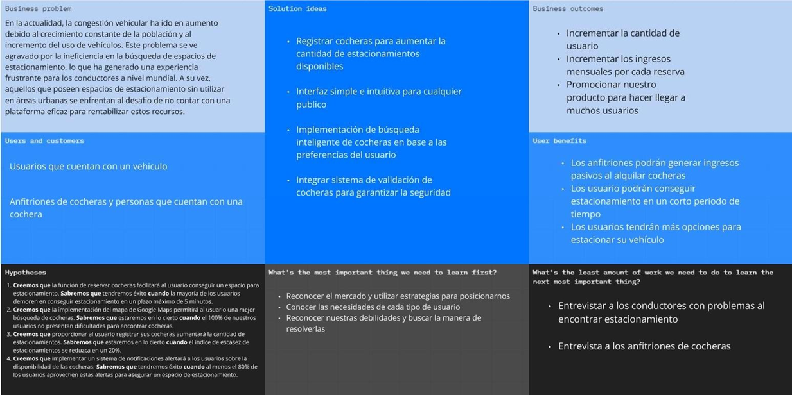

# Universidad Peruana de Ciencias Aplicadas

### INFORME DEL TRABAJO 1 (TB1)

**Curso:** Diseño de Experimentos de Ingeniería de Software

**Sección:** 1ASI0732

**Profesor:** Julio Manuel Noriega Melendez

**Carrera:** Nombre de la carrera

**Ciclo:** 2025-01

**Startup:** Netvia

**Producto:** HomeyPark

### Integrantes:

| Nombre                          | Código     |
| ------------------------------- | ---------- |
| Sebastian Cachis Gonzales       | u202210846 |
| Adriano Sebastian Cruz Palomino | u202210697 |
| Amner Levi Llamo Sanchez        | u20221c376 |
| Marcelo Fabian Garro Vega       | u20201c410 |
| Lucio Heli Yen Cerna            | u202213143 |

### Abril del 2025

### Registro de versiones del informe

| Versión | Fecha      | Autor            | Descripción                           |
| ------- | ---------- | ---------------- | ------------------------------------- |
| 1.0     | 05/04/2025 | Adriano Cruz     | Creación de la estructura del informe |
| 1.0     | 06/04/2025 | Sebastian Cachis | Desarrollo del capítulo I      |

### Project Report Collaboration Insights

**TB1**  
Para el desarrollo del informe perteneciente a la entrega TB1, se dividió la implementación de secciones de la siguiente forma para cada integrante del equipo:

| Integrante              | Tareas Designadas                |
| ----------------------- | -------------------------------- |
| Sebastian Cachis        | Desarrollo de todo el capítulo I |
| [Nombre del integrante] | [Tareas]                         |
| ...                     | ...                              |

# Tabla de Contenidos

### [Student Outcome](#outcome)

### [Capítulo I: Introducción](#capitulo-i-introduccion)

- [1.1. Startup Profile](#11-startup-profile)
  - [1.1.1. Descripción de la Startup](#111-descripción-de-la-startup)
  - [1.1.2. Perfiles de integrantes del equipo](#112-perfiles-de-integrantes-del-equipo)
- [1.2. Solution Profile](#12-solution-profile)
  - [1.2.1. Antecedentes y problemática](#121-antecedentes-y-problemática)
  - [1.2.2. Lean UX Process](#122-lean-ux-process)
    - [1.2.2.1. Lean UX Problem Statements](#1221-lean-ux-problem-statements)
    - [1.2.2.2. Lean UX Assumptions](#1222-lean-ux-assumptions)
    - [1.2.2.3. Lean UX Hypothesis Statements](#1223-lean-ux-hypothesis-statements)
    - [1.2.2.4. Lean UX Canvas](#1224-lean-ux-canvas)
- [1.3. Segmentos objetivo](#13-segmentos-objetivo)

### [Capítulo II: Requirements Elicitation & Analysis](#capitulo-ii-requirements-elicitation--analysis)

- [2.1. Competidores](#21-competidores)
  - [2.1.1. Análisis competitivo](#211-análisis-competitivo)
  - [2.1.2. Estrategias y tácticas frente a competidores](#212-estrategias-y-tácticas-frente-a-competidores)
- [2.2. Entrevistas](#22-entrevistas)
  - [2.2.1. Diseño de entrevistas](#221-diseño-de-entrevistas)
  - [2.2.2. Registro de entrevistas](#222-registro-de-entrevistas)
  - [2.2.3. Análisis de entrevistas](#223-análisis-de-entrevistas)
- [2.3. Needfinding](#23-needfinding)
  - [2.3.1. User Personas](#231-user-personas)
  - [2.3.2. User Task Matrix](#232-user-task-matrix)
  - [2.3.3. User Journey Mapping](#233-user-journey-mapping)
  - [2.3.4. Empathy Mapping](#234-empathy-mapping)
  - [2.3.5. As-is Scenario Mapping](#235-as-is-scenario-mapping)
- [2.4. Ubiquitous Language](#24-ubiquitous-language)

### [Capítulo III: Requirements Specification](#capitulo-iii-requirements-specification)

- [3.1. To-Be Scenario Mapping](#31-to-be-scenario-mapping)
- [3.2. User Stories](#32-user-stories)
- [3.3. Product Backlog](#33-product-backlog)
- [3.4. Impact Mapping](#34-impact-mapping)

### [Capítulo IV: Product Design](#capitulo-iv-product-design)

- [4.1. Style Guidelines](#41-style-guidelines)
  - [4.1.1. General Style Guidelines](#411-general-style-guidelines)
  - [4.1.2. Web Style Guidelines](#412-web-style-guidelines)
  - [4.1.3. Mobile Style Guidelines](#413-mobile-style-guidelines)
    - [4.1.3.1. iOS Mobile Style Guidelines](#4131-ios-mobile-style-guidelines)
    - [4.1.3.2. Android Mobile Style Guidelines](#4132-android-mobile-style-guidelines)
- [4.2. Information Architecture](#42-information-architecture)
  - [4.2.1. Organization Systems](#421-organization-systems)
  - [4.2.2. Labeling Systems](#422-labeling-systems)
  - [4.2.3. SEO Tags and Meta Tags](#423-seo-tags-and-meta-tags)
  - [4.2.4. Searching Systems](#424-searching-systems)
  - [4.2.5. Navigation Systems](#425-navigation-systems)
- [4.3. Landing Page UI Design](#43-landing-page-ui-design)
  - [4.3.1. Landing Page Wireframe](#431-landing-page-wireframe)
  - [4.3.2. Landing Page Mock-up](#432-landing-page-mock-up)
- [4.4. Mobile Applications UX/UI Design](#44-mobile-applications-uxui-design)
  - [4.4.1. Mobile Applications Wireframes](#441-mobile-applications-wireframes)
  - [4.4.2. Mobile Applications Wireflow Diagrams](#442-mobile-applications-wireflow-diagrams)
  - [4.4.3. Mobile Applications Mock-ups](#443-mobile-applications-mock-ups)
  - [4.4.4. Mobile Applications User Flow Diagrams](#444-mobile-applications-user-flow-diagrams)
- [4.5. Mobile Applications Prototyping](#45-mobile-applications-prototyping)
  - [4.5.1. Android Mobile Applications Prototyping](#451-android-mobile-applications-prototyping)
  - [4.5.2. iOS Mobile Applications Prototyping](#452-ios-mobile-applications-prototyping)
- [4.6. Web Applications UX/UI Design](#46-web-applications-uxui-design)
  - [4.6.1. Web Applications Wireframes](#461-web-applications-wireframes)
  - [4.6.2. Web Applications Wireflow Diagrams](#462-web-applications-wireflow-diagrams)
  - [4.6.3. Web Applications Mock-ups](#463-web-applications-mock-ups)
  - [4.6.4. Web Applications User Flow Diagrams](#464-web-applications-user-flow-diagrams)
- [4.7. Web Applications Prototyping](#47-web-applications-prototyping)
- [4.8. Domain-Driven Software Architecture](#48-domain-driven-software-architecture)
  - [4.8.1. Software Architecture Context Diagram](#481-software-architecture-context-diagram)
  - [4.8.2. Software Architecture Container Diagrams](#482-software-architecture-container-diagrams)
  - [4.8.3. Software Architecture Components Diagrams](#483-software-architecture-components-diagrams)
- [4.9. Software Object-Oriented Design](#49-software-object-oriented-design)
  - [4.9.1. Class Diagrams](#491-class-diagrams)
  - [4.9.2. Class Dictionary](#492-class-dictionary)
- [4.10. Database Design](#410-database-design)
  - [4.10.1. Relational/Non-Relational Database Diagram](#4101-relationalnon-relational-database-diagram)

### [Capítulo V: Product Implementation](#capitulo-v-product-implementation)

- [5.1. Software Configuration Management](#51-software-configuration-management)
  - [5.1.1. Software Development Environment Configuration](#511-software-development-environment-configuration)
  - [5.1.2. Source Code Management](#512-source-code-management)
  - [5.1.3. Source Code Style Guide & Conventions](#513-source-code-style-guide--conventions)
  - [5.1.4. Software Deployment Configuration](#514-software-deployment-configuration)
- [5.2. Product Implementation & Deployment](#52-product-implementation--deployment)
  - [5.2.1. Sprint Backlogs](#521-sprint-backlogs)
  - [5.2.2. Implemented Landing Page Evidence](#522-implemented-landing-page-evidence)
  - [5.2.3. Implemented Frontend-Web Application Evidence](#523-implemented-frontend-web-application-evidence)
  - [5.2.4. Implemented Native-Mobile Application Evidence](#524-implemented-native-mobile-application-evidence)
  - [5.2.5. Implemented RESTful API and/or Serverless Backend Evidence](#525-implemented-restful-api-andor-serverless-backend-evidence)
  - [5.2.6. RESTful API documentation](#526-restful-api-documentation)
  - [5.2.7. Team Collaboration Insights](#527-team-collaboration-insights)
- [5.3. Video About-the-Product](#53-video-about-the-product)

- [Conclusiones, Bibliografía y Anexos](#conclusiones-bibliografía-y-anexos)

<h1 id="outcome">Student Outcome</h1>

### Student Outcome

| Criterio específico                                                                                                                                    | Acciones Realizadas                                                                                                                                                                                                                                                                                | Conclusiones                                                                                                                                  |
| ------------------------------------------------------------------------------------------------------------------------------------------------------ | -------------------------------------------------------------------------------------------------------------------------------------------------------------------------------------------------------------------------------------------------------------------------------------------------- | --------------------------------------------------------------------------------------------------------------------------------------------- |
| Reconoce responsabilidad ética y profesional en situaciones de ingeniería de software                                                                  | Sebastian Nicolas Cachis Gonzales <b>TB1</b> Para esta entrega desarrolle el capitulo 1, hice entrevistas y tambien los diseños para la landingPage  [Nombre del integrante] <b>TB1</b> [Descripción de acciones realizadas]                                                     | <b>TB1</b>  Designamos tareas a cada integrante para optimizar el tiempo de trabajo                                                        |
| Emite juicios informados considerando el impacto de las soluciones de ingeniería de software en contextos globales, económicos, ambientales y sociales | Sebastian Nicolas Cachis Gonzales  <b>TB1</b> Esto me ha permito tener una mejor vision de los limites y objetivos de nuestro proyecto asi como conocer las inquietudes de nuestros segmentos objetvios  [Nombre del integrante] <b>TB1</b> [Descripción de acciones realizadas] | <b>TB1</b>  Hemos enfocado las habilidades de cada integrante en las areas de desarrollo que mejor dominen para una mejor linea de trabajo |

<h1 id="capitulo-i-introduccion">Capítulo I: Introducción</h1>

## 1.1. Startup Profile

### 1.1.1. Descripción de la Startup

Nuestro equipo SwapService ha sido creado con el propósito de solucionar la preocupación por la
escasez de espacios de estacionamiento en entornos urbanos. La congestión del tráfico y la ineficiente
búsqueda de estacionamientos genera una gran frustración para el conductor. HomeyPark propone
revolucionar la forma en que las personas encuentran y utilizan espacios de estacionamiento.
Desarrollaremos una aplicación que ofrecerá una interfaz intuitiva, permitiendo a los usuarios buscar,
reservar y pagar por estacionamientos de manera sencilla y rápida.

## Misión

Facilitar el intercambio equitativo de habilidades y servicios entre personas, empoderando a las comunidades para crear valor compartido sin intermediación monetaria, promoviendo así una economía colaborativa basada en el talento y las conexiones humanas.

## Visión

Ser la plataforma líder global en intercambio de servicios peer-to-peer, transformando la manera en que las personas intercambian valor, fomentando una sociedad más colaborativa donde el acceso a servicios y conocimientos no esté limitado por restricciones económicas sino potenciado por el talento colectivo de la comunidad.

### 1.1.2. Perfiles de integrantes del equipo

|                                                                                                                                                                                                                                             Descripción de los perfiles de los integrantes del equipo                                                                                                                                                                                                                                              |                                                Foto del integrante                                                |
| :------------------------------------------------------------------------------------------------------------------------------------------------------------------------------------------------------------------------------------------------------------------------------------------------------------------------------------------------------------------------------------------------------------------------------------------------------------------------------------------------------------------------------------------------: | :---------------------------------------------------------------------------------------------------------------: |
|                                                                                                                                Mi nombre es Soy un estudiante de 22 años con interés en el desarrollo web y móvil. Disfruto aprender nuevas tecnologías y colaborar en proyectos donde pueda aportar con mis conocimientos. Me motiva compartir experiencias con otros y crecer junto a mi equipo en cada desafío.                                                                                                                                 |                                                        |
|                                                                                                  Mi nombre es **Amner Levi Llamo Sánchez**, soy estudiante del séptimo ciclo de ingeniería de software en la UPC. Me gusta jugar fútbol y videojuegos, por eso estoy constantemente investigando sobre nuevas tecnologías. Soy responsable con los trabajos que se me asignan; además soy tolerante y me adapto a las circunstancias del equipo.                                                                                                   |                                   |
|                                                                                         Mi nombre es **Sebastian Nicolas Cachis Gonzales**, soy estudiante de séptimo ciclo de ingeniería de software en la UPC. Me considero una persona proactiva, organizada, meticulosa y muy enfocada en mis estudios, tanto grupales como individuales. Tengo facilidad para entender y ejemplificar los distintos temas que vemos, teniendo soltura para explicar.                                                                                          |                                                       |
|                                                                                                                               Mi nombre es **Adriano Sebastian Cruz Palomino**, tengo 20 años, soy alumno de Ingeniería de Software en la UPC, actualmente estoy cursando el 7mo ciclo. Soy una persona curiosa, responsable, y comprometida con mis estudios, siempre busco aprender más y mejorar mis habilidades.                                                                                                                               |                                                          |
| Mi nombre es **Lucio Heli Yen Cerna**, soy estudiante del séptimo ciclo de la carrera de Ingeniería de Software en la UPC. Soy una persona proactiva y organizada que se esmera en construir productos de calidad innovadores. Me apasiona mucho trabajar en equipo, debatir y compartir una misma motivación debido a que siento que aprendo de mis propios compañeros y mejoro como profesional. Por otro lado, mis hobbies son el gimnasio, la música y los videojuegos los cuáles me permiten llevar un estilo de vida balanceado y saludable. |  |

## 1.2. Solution Profile

### 1.2.1. Antecedentes y problemática

En la actualidad, la congestión vehicular ha ido en aumento debido al crecimiento constante de la
población y al incremento del uso de vehículos. Este problema se ve agravado por la ineficiencia en la
búsqueda de espacios de estacionamiento, lo que ha generado una experiencia frustrante para los
conductores a nivel mundial. A su vez, aquellos que poseen espacios de estacionamiento sin utilizar en
áreas urbanas se enfrentan al desafío de no contar con una plataforma eficaz para rentabilizar estos
recursos.

**What?**

Nuestro startup ha identificado como problemática principal la escasez de espacios de estacionamiento
en entornos urbanos y la complejidad que representa actualmente encontrar un lugar para estacionar.
Esto se debe a la elevada demanda de vehículos para las actividades cotidianas.

**When?**

Esta preocupación ha ido en aumento a lo largo del tiempo, ya que las ciudades han visto crecer su
población, lo que ha resultado en un mayor número de vehículos en circulación. En los últimos años, la
congestión del tráfico y la dificultad para encontrar estacionamiento se han vuelto problemas más
urgentes.

**Where?**

El problema se presenta principalmente en áreas urbanas densamente pobladas a nivel global, donde el
espacio es limitado y la demanda de estacionamiento es alta.

**Who?**

Los conductores son los principales afectados por este problema, ya que se enfrentan a dificultades
para encontrar estacionamientos convenientes. Además, los propietarios de espacios de
estacionamiento se ven en desventaja frente a grandes empresas del sector, lo que complica la
promoción y alquiler de sus servicios.

**Why?**

La causa principal radica en la insuficiencia de espacios de estacionamiento disponibles en áreas
urbanas, lo que intensifica la congestión vehicular y dificulta que los conductores encuentren un lugar
para estacionar en el momento oportuno.

**How?**

El problema ocurre cuando la congestión del tráfico, combinada con la falta de espacios de
estacionamiento, impide que la población pueda estacionar de manera eficiente y conveniente.

**How much?**

Este problema afecta de manera notable a Lima, la capital, donde según un estudio realizado por la
ONG Luz Ámbar en 2016, existe una carencia de aproximadamente 45,000 espacios de
estacionamiento en cinco distritos. Sin embargo, esta cifra es insuficiente en comparación con la
cantidad de vehículos en la ciudad, que alcanza aproximadamente 1 millón 800,000 unidades. Esta
discrepancia entre la cantidad de vehículos y la disponibilidad de estacionamientos contribuye
significativamente a la congestión vehicular y al desafío constante de encontrar un lugar adecuado para
estacionar.

### 1.2.2. Lean UX Process

### 1.2.2.1. Lean UX Problem Statements

El desarrollo de HomeyPark sigue la metodología Lean UX, que combina el pensamiento Lean Startup con el diseño centrado en el usuario. Este enfoque nos permite validar rápidamente nuestras hipótesis de valor y crear soluciones adaptadas a las necesidades reales de los usuarios con el mínimo de recursos.

**Problem Statement 1: Usuarios de parking**

En la actualidad, muchos ciudadanos de las zonas urbanas del Perú requieren de un vehículo
motorizado para realizar tramos largos de viaje. Debido a su alta demanda, el diario “El Comercio”
(2024) revela que el 51% de conductores de la ciudad de Lima consideran necesario incrementar la
cantidad de espacios para estacionar.

Hemos encontrado que los conductores presentan dificultades para encontrar espacios de
estacionamiento disponibles, tomando un aproximado de 10 horas totales al mes para conseguir uno.

¿Cómo podemos buscar o proporcionar más espacios de estacionamiento para los usuarios de forma
eficiente y rápida para sus vehículos motorizados?

**Problem Statement 2: Anfitriones**

Nuestra aplicación permitirá a los usuarios poder promocionar sus garajes para obtener una fuente de
ingresos adicional sin interrupción en sus actividades del día a día. Esto favorecerá a las comunidades
para la reducción de la congestión vehicular.

Hemos encontrado que muchos propietarios no están dispuestos a ofrecer su garaje en alquiler debido
al anonimato de los clientes, lo cual genera una sensación de inseguridad en estas entidades.

¿Cómo podemos implementar un sistema de seguridad que vele por la integridad, bienes y bienes
inmobiliarios de nuestros usuarios de la aplicación?

### 1.2.2.2. Lean UX Assumptions

**Business Assumptions**

1. Creo que mis usuarios necesitan una mejor opción de encontrar estacionamientos y, de ser
posible, reservarlos.

2. Estas necesidades se pueden resolver con una aplicación móvil que les permita a los
conductores reservar en los garajes de la ciudad, debido a que la mayoría del tiempo se
encuentran disponibles.

3. Mis clientes iniciales son las personas que cuenten con un vehículo y que tengan dificultades
de encontrar algún estacionamiento disponible.

4. El valor #1 que el cliente requiere de mi servicio es encontrar y reservar espacios para
estacionar en un corto periodo de tiempo de forma segura.

5. Voy a adquirir a mis clientes a través de estrategias de marketing en diversas redes sociales,
mostrando todos los beneficios que da nuestra aplicación móvil.

6. Mi competencia en el mercado serán las empresas que se dedican a ofrecer sus servicios de
estacionamiento.

7. Los venceremos debido a que ofrecemos a los usuarios poder generar ingresos de manera
pasiva al rentar sus garajes como estacionamiento.

8. Mis mayores riesgos del producto es no encontrar una manera de brindar seguridad a los
conductores como a los propietarios de los garajes.

9. Resolveremos esto con la incorporación de un sistema que se encargue de validar los
parámetros de seguridad de los conductores y los garajes en alquiler para ofrecer una mejor
seguridad al público.

**User Assumptions**

*Usuarios de parking*

**¿Quién es el usuario?** Conductores que en su día a día necesitan encontrar estacionamiento para sus
vehículos.

**¿Dónde encaja nuestro servicio?** Nuestro servicio encaja tanto para su trabajo como para sus
actividades diarias.

**¿Qué problema tiene nuestro servicio y cómo se resuelve?** El problema es sobre la posible
inseguridad del usuario al alquilar en una cochera de cualquier persona desconocida. Se puede resolver
mediante un sistema de filtros que garanticen al usuario la seguridad de la cochera y contar con bases
legales para la publicación del producto.

**¿Cuándo y cómo es usado nuestro producto?** Nuestro producto será usado mayormente cuando el
usuario necesite encontrar algún estacionamiento para realizar cualquier actividad. La aplicación móvil
se podrá usar como un sistema de búsqueda y reserva de cocheras.

*Anfitriones*

**¿Quién es el usuario?** Personas con garajes que desean poner en alquiler para generar ingresos.

**¿Dónde encaja nuestro servicio?** Nuestro servicio encaja en su vida porque pueden poner en alquiler
sus garajes mientras realizan cualquier actividad.

**¿Qué problema tiene nuestro servicio y cómo se resuelve?** El problema será el proceso para poder
registrar sus cocheras, debido a que puede llegar a ser confuso o tedioso para el anfitrión. Lo podemos
resolver mediante capacitación sobre el proceso de filtros para facilitar al usuario el registro.

**¿Cuándo y cómo es usado nuestro producto?** Nuestra aplicación es usada principalmente cuando el
anfitrión dispone de cualquier garaje disponible que desee poner en alquiler para generar ingresos.
Nuestro producto es usado como un gestor de cocheras sobre reservas, estados, recibos, etc. 

### 1.2.2.3. Lean UX Hypothesis Statements

1. Creemos que la función de reservar cocheras facilitará al usuario conseguir un espacio para
estacionamiento. Sabremos que tendremos éxito cuando la mayoría de los usuarios demoren
en conseguir estacionamiento en un plazo máximo de 5 minutos.

2. Creemos que la implementación del mapa de Google Maps permitirá al usuario una mejor
búsqueda de cocheras. Sabremos que estaremos en lo cierto cuando el 100% de nuestros
usuarios no presentan dificultades para encontrar cocheras.

3. Creemos que proporcionar al usuario registrar sus cocheras aumentará la cantidad de
estacionamientos. Sabremos que estaremos en lo cierto cuando el índice de escasez de
estacionamientos se reduzca en un 20%.

4. Creemos que implementar un sistema de notificaciones alertará a los usuarios sobre la
disponibilidad de las cocheras. Sabremos que tendremos éxito cuando al menos el 80% de los
usuarios aprovechen estas alertas para asegurar un espacio de estacionamiento.

### 1.2.2.4. Lean UX Canvas

## 1.3. Segmentos objetivo

Nuestro segmento objetivo está compuesto por dos usuarios:

**Usuarios de parking:** Persona que busca alguna solución para su necesidad que es buscar un
estacionamiento en entornos urbanos para su vehículo

**Anfitrión:** Propietario de una vivienda que cuente con una cochera privada que busque sacar
provecho de forma efectiva.

<h1 id="capitulo-ii-requirements-elicitation--analysis">Capítulo II: Requirements Elicitation & Analysis</h1>

## 2.1. Competidores

### 2.1.1. Análisis competitivo

El mercado de plataformas de intercambio de servicios es dinámico y diverso, con varias soluciones que facilitan la conexión entre personas para compartir habilidades y tareas. A continuación, se describen algunas de las plataformas más destacadas en este ámbito.

1. Timebucks
   Timebucks es una plataforma que permite a los usuarios ganar dinero realizando pequeñas tareas en línea, como completar encuestas, ver videos y probar aplicaciones. Ofrece una variedad de tareas accesibles para una amplia audiencia, aunque algunas pueden tener un valor muy bajo.

2. Simbi
   Simbi es una plataforma de intercambio de servicios que permite a los usuarios ofrecer y recibir servicios sin intercambio de dinero, utilizando un sistema de créditos llamado "simbi". Promueve un modelo de economía colaborativa y fomenta la creación de una comunidad de usuarios que valoran el intercambio de habilidades.

3. TaskRabbit
   TaskRabbit conecta a personas que necesitan ayuda con tareas diarias con "Taskers" dispuestos a realizar esas tareas por una tarifa. Ofrece una amplia gama de servicios y facilita la confianza a través de mecanismos de verificación y reseñas, aunque depende del intercambio de dinero y cobra comisiones por los servicios.

### 2.1.2. Estrategias y tácticas frente a competidores

<table> <tr> <th colspan="6" valign="top">Competitive Analysis Landscape</th> </tr> <tr> <td colspan="2" valign="top">¿Por qué llevar a cabo este análisis?</td> <td colspan="4" valign="top">Un análisis competitivo ayuda a identificar oportunidades y mejorar su propuesta de valor para mantenerse relevante en el mercado.</td> </tr> <tr> <td colspan="2" valign="top"></td> <td valign="top">SwapService</td> <td valign="top">Timebucks</td> <td valign="top">Simbi</td> <td valign="top">TaskRabbit</td> </tr> <tr> <td rowspan="2" valign="top">Perfil</td> <td valign="top">Overview</td> <td valign="top">Plataforma de intercambio de servicios sin dinero, fomentando una economía colaborativa.</td> <td valign="top">Plataforma de tareas en línea remuneradas.</td> <td valign="top">Intercambio de servicios basado en créditos sin dinero.</td> <td valign="top">Conecta personas que necesitan ayuda con tareas diarias con "Taskers" por una tarifa.</td> </tr> <tr> <td valign="top">Ventaja competitiva ¿Qué valor ofrece a los clientes?</td> <td valign="top">Acceso a servicios sin barreras económicas y fortalecimiento de la comunidad.</td> <td valign="top">Diversidad de tareas accesibles para ganar dinero.</td> <td valign="top">Intercambio de habilidades sin necesidad de dinero.</td> <td valign="top">Facilidad para encontrar ayuda con tareas diarias.</td> </tr> <tr> <td rowspan="2" valign="top">Perfil de Marketing</td> <td valign="top">Mercado objetivo</td> <td valign="top">Jóvenes universitarios y profesionales independientes.</td> <td valign="top">Usuarios de internet buscando ingresos adicionales.</td> <td valign="top">Personas interesadas en economías colaborativas.</td> <td valign="top">Personas que necesitan ayuda con tareas diarias.</td> </tr> <tr> <td valign="top">Estrategias de marketing</td> <td valign="top">Marketing digital y boca a boca.</td> <td valign="top">Publicidad en línea y redes sociales.</td> <td valign="top">Marketing de contenido y comunidades en línea.</td> <td valign="top">Publicidad local y asociaciones con empresas.</td> </tr> <tr> <td rowspan="3" valign="top">Perfil de Producto</td> <td valign="top">Productos & Servicios</td> <td valign="top">Intercambio de servicios y habilidades.</td> <td valign="top">Tareas en línea remuneradas.</td> <td valign="top">Intercambio de servicios basado en créditos.</td> <td valign="top">Servicios de tareas diarias.</td> </tr> <tr> <td valign="top">Precios & Costos</td> <td valign="top">Sin costo monetario, basado en intercambio.</td> <td valign="top">Pagos por tarea completada.</td> <td valign="top">Sin costo monetario, basado en créditos.</td> <td valign="top">Tarifas por servicio más comisiones.</td> </tr> <tr> <td valign="top">Canales de distribución (Web y/o Móvil)</td> <td valign="top">Aplicación móvil y web.</td> <td valign="top">Aplicación móvil y web.</td> <td valign="top">Aplicación móvil y web.</td> <td valign="top">Aplicación móvil y web.</td> </tr> <tr> <td rowspan="4" valign="top">Análisis SWOT</td> <td valign="top">Fortalezas</td> <td valign="top">Fomento de comunidad y sostenibilidad.</td> <td valign="top">Diversidad de tareas y accesibilidad.</td> <td valign="top">Modelo de intercambio sin dinero.</td> <td valign="top">Facilidad de uso y confianza.</td> </tr> <tr> <td valign="top">Debilidades</td> <td valign="top">Dependencia de la adopción comunitaria.</td> <td valign="top">Valor bajo de algunas tareas.</td> <td valign="top">Confusión potencial con el sistema de créditos.</td> <td valign="top">Dependencia del dinero y comisiones.</td> </tr> <tr> <td valign="top">Oportunidades</td> <td valign="top">Expansión a nuevos mercados y comunidades.</td> <td valign="top">Diversificación de tareas y aumento de valor.</td> <td valign="top">Crecimiento en economías colaborativas.</td> <td valign="top">Expansión de servicios y alianzas.</td> </tr> <tr> <td valign="top">Amenazas</td> <td valign="top">Competencia creciente y cambios en preferencias de usuarios.</td> <td valign="top">Competencia en el mercado de tareas en línea.</td> <td valign="top">Competencia y adopción limitada.</td> <td valign="top">Competencia y dependencia de la economía tradicional.</td> </tr> </table>

## 2.2. Entrevistas

### 2.2.1. Diseño de entrevistas

Para obtener una comprensión profunda de las necesidades y expectativas de los usuarios potenciales de SwapService, se diseñarán entrevistas estructuradas con preguntas específicas para diferentes segmentos de usuarios. A continuación, se presentan las preguntas para cada grupo:

**Preguntas Generales**

- ¿Qué te motiva a utilizar una plataforma de intercambio de servicios sin dinero?
- ¿Qué tipo de servicios o habilidades estarías dispuesto a ofrecer en una plataforma como SwapService?
- ¿Qué barreras encuentras actualmente para acceder a servicios profesionales que necesitas?
- ¿Cómo evalúas la confianza y seguridad en una plataforma de intercambio de servicios?

**Preguntas para Jóvenes Universitarios y Recién Egresados**

- ¿Con qué frecuencia buscas alternativas económicas para acceder a servicios o productos?
- ¿Qué tipo de servicios o conocimientos te gustaría intercambiar con otros estudiantes o profesionales?
- ¿Cómo te sientes acerca de la idea de intercambiar tiempo y habilidades en lugar de dinero?
- ¿Qué características consideras importantes en una plataforma que facilite el intercambio de servicios entre estudiantes?
- ¿Cómo crees que una plataforma como SwapService podría ayudarte en tu desarrollo personal y profesional?

**Preguntas para Jóvenes Emprendedores o Freelancers**

- ¿Qué desafíos enfrentas actualmente en la monetización de tus habilidades o servicios?
- ¿Cómo gestionas los periodos de baja demanda en tu trabajo freelance?
- ¿Qué tipo de servicios o habilidades te gustaría intercambiar con otros profesionales independientes?
- ¿Cómo evalúas el valor de tus servicios cuando consideras un intercambio no monetario?
- ¿Qué beneficios esperas obtener al participar en una comunidad de intercambio de servicios como SwapService?

### 2.2.2. Registro de entrevistas

| Nombre entrevistado                                        | Augusto Granados                                                                                                                                                                                                                                                                                                                                                                                                                                                                                                                                                                                                                                                                                                                                                                                                                                                                                                                                                                                                                                                                                                                                                                                                                                                                                                                                                                                                                                                                                                                                                                                                                                                                                                                                                                                                                                                                                                                                                       |
| ---------------------------------------------------------- | ---------------------------------------------------------------------------------------------------------------------------------------------------------------------------------------------------------------------------------------------------------------------------------------------------------------------------------------------------------------------------------------------------------------------------------------------------------------------------------------------------------------------------------------------------------------------------------------------------------------------------------------------------------------------------------------------------------------------------------------------------------------------------------------------------------------------------------------------------------------------------------------------------------------------------------------------------------------------------------------------------------------------------------------------------------------------------------------------------------------------------------------------------------------------------------------------------------------------------------------------------------------------------------------------------------------------------------------------------------------------------------------------------------------------------------------------------------------------------------------------------------------------------------------------------------------------------------------------------------------------------------------------------------------------------------------------------------------------------------------------------------------------------------------------------------------------------------------------------------------------------------------------------------------------------------------------------------------------- |
| Edad                                                       | 20 años                                                                                                                                                                                                                                                                                                                                                                                                                                                                                                                                                                                                                                                                                                                                                                                                                                                                                                                                                                                                                                                                                                                                                                                                                                                                                                                                                                                                                                                                                                                                                                                                                                                                                                                                                                                                                                                                                                                                                                |
| Departamento                                               | Lima, Lima                                                                                                                                                                                                                                                                                                                                                                                                                                                                                                                                                                                                                                                                                                                                                                                                                                                                                                                                                                                                                                                                                                                                                                                                                                                                                                                                                                                                                                                                                                                                                                                                                                                                                                                                                                                                                                                                                                                                                             |
|  | Augusto Granados no cuenta con el pasar del tiempo, la necesidad de conocer herramientas y métodos estadísticos son muy importantes para poder seguir con su carrera una vez ya egresado. Como el saber programación para la manipulación de datos estadísticos. El contar con una aplicación que le permita intercambiar conocimientos de forma gratuita es de mucha ayuda y factible para quienes no posean con los recursos, pero si tengan la intención de querer seguir aprendiendo y cuente algo que ofrecer                                                                                                                                                                                                                                                                                                                                                                                                                                                                                                                                                                                                                                                                                                                                                                                                                                                                                                                                                                                                                                                                                                                                                                                                                                                                                                                                                                                                                                                     |
| Duración entrevista: 00:00-09:27                           | URL: [https://upcedupe-my.sharepoint.com/:v:/g/personal/u202210846_upc_edu_pe/EUu1idGzQANCuxR4aUX4dLEBM9jZrfD_o_Am6yvitXcUpQ?nav=eyJyZWZlcnJhbEluZm8iOnsicmVmZXJyYWxBcHAiOiJTdHJlYW1XZWJBcHAiLCJyZWZlcnJhbFZpZXciOiJTaGFyZURpYWxvZy1MaW5rIiwicmVmZXJyYWxBcHBQbGF0Zm9ybSI6IldlYiIsInJlZmVycmFsTW9kZSI6InZpZXcifX0%3D&e=sVtiCe]                                                                                                                                                                                                                                                                                                                                                                                                                                                                                                                                                                                                                                                                                                                                                                                                                                                                                                                                                                                                                                                                                                                                                                                                                                                                                                                                                                                                                                                                                                                                                                                                                                          |
| Nombre entrevistado                                        | Walter Cachay                                                                                                                                                                                                                                                                                                                                                                                                                                                                                                                                                                                                                                                                                                                                                                                                                                                                                                                                                                                                                                                                                                                                                                                                                                                                                                                                                                                                                                                                                                                                                                                                                                                                                                                                                                                                                                                                                                                                                          |
| Edad                                                       | 21 años                                                                                                                                                                                                                                                                                                                                                                                                                                                                                                                                                                                                                                                                                                                                                                                                                                                                                                                                                                                                                                                                                                                                                                                                                                                                                                                                                                                                                                                                                                                                                                                                                                                                                                                                                                                                                                                                                                                                                                |
| Departamento                                               | Surco, Lima                                                                                                                                                                                                                                                                                                                                                                                                                                                                                                                                                                                                                                                                                                                                                                                                                                                                                                                                                                                                                                                                                                                                                                                                                                                                                                                                                                                                                                                                                                                                                                                                                                                                                                                                                                                                                                                                                                                                                            |
|    | Walter Cachay es un estudiante de 21 años cursando el séptimo ciclo de ingeniería mecatrónica, motivado a utilizar una plataforma de intercambio de servicios sin dinero principalmente por razones económicas. Considera que este modelo podría promover un mejor nivel de enseñanza y aprendizaje tanto nacional como mundialmente, permitiéndole ofrecer sus conocimientos a cambio de aprender de otros. Está dispuesto a enseñar programación básica y avanzada, matemáticas relacionadas con su carrera, y como hobby, enseñar a tocar la trompeta. Las principales barreras que identifica para acceder a servicios profesionales son los costos de suscripciones en plataformas y aplicaciones, especialmente para clases de idiomas como el inglés, que son importantes para mejorar su currículum y son requeridas por la universidad. Para evaluar la confianza en una plataforma, considera fundamentales los comentarios, reseñas y sistemas de calificación.Walter busca alternativas económicas con frecuencia, aproximadamente dos o tres veces por semana, comparando precios y buscando promociones o descuentos para estudiantes. Le interesaría aprender francés, diseño web, economía y profundizar sus conocimientos en programación y automatización. Considera que intercambiar tiempo y habilidades es una idea muy interesante que promueve la ayuda mutua entre personas de distintos lugares. Las características que valora en una plataforma incluyen facilidad de uso, diseño atractivo, sistema de búsqueda eficiente, reseñas visibles y la posibilidad de comunicación directa con los proveedores de servicios. Cree que una plataforma como SwapService podría contribuir significativamente a su desarrollo personal y profesional, permitiéndole acceder a conocimientos y desarrollar habilidades que de otra manera serían inaccesibles por limitaciones económicas, además de descubrir nuevas habilidades que aún no conoce. |
| Duración entrevista 00:00-08:15                            | URL [https://upcedupe-my.sharepoint.com/:v:/g/personal/u20221c376_upc_edu_pe/EdMQe7U_565KqVCIYAcidt4BNohwZtyNYGp-bDuZQzAV_g?e=wuiJe6]                                                                                                                                                                                                                                                                                                                                                                                                                                                                                                                                                                                                                                                                                                                                                                                                                                                                                                                                                                                                                                                                                                                                                                                                                                                                                                                                                                                                                                                                                                                                                                                                                                                                                                                                                                                                                                  |

**_Jóvenes Emprendedores o Freelancers_**
|Nombre entrevistado|William Sánchez|
|-|-|
|Edad|24 años|
|Departamento|Lima, Lima|
||William Sánchez, emprendedor de 24 años especializado en networking, busca utilizar una plataforma de intercambio de servicios sin dinero para optimizar recursos y establecer relaciones profesionales basadas en valor real. Ofrece servicios de estrategias digitales de marketing, consultoría de e-commerce, optimización de negocios y diseño UX/UI. Como emprendedor inicial con presupuesto limitado, enfrenta barreras para acceder a asesoría legal, contabilidad especializada y software, valorando en plataformas de intercambio los sistemas de verificación sólidos, portafolios demostrables y garantías en caso de disputas. Para valorar sus servicios en intercambios no monetarios, considera el tiempo invertido, su tarifa habitual y el valor potencial del servicio que recibe. Le interesaría intercambiar por servicios de copyrighting, SEO, asesoría contable y fiscal para aumentar la productividad de su negocio. Durante periodos de baja demanda, mejora su portafolio, trabaja en proyectos personales y refuerza su networking. De una plataforma como Swap Service espera acceder a servicios profesionales que normalmente no podría costear, expandir su red de contactos y aplicar sus habilidades en diversos contextos para enriquecer su experiencia profesional.|
|Duración entrevista: 00:00-06:38 |URL: [https://upcedupe-my.sharepoint.com/:v:/g/personal/u20221c376_upc_edu_pe/ETZgkPk0OI1ApIxTCPOS9DkBtVWBa6BQq6cUHcMqI2qyyQ?e=WiaaWG]|

| Nombre entrevistado                                     | George Pimentel                                                                                                                                                                                                                                                                                                                                                                                                                                                                                                                                                                                                                                                                                                 |
| ------------------------------------------------------- | --------------------------------------------------------------------------------------------------------------------------------------------------------------------------------------------------------------------------------------------------------------------------------------------------------------------------------------------------------------------------------------------------------------------------------------------------------------------------------------------------------------------------------------------------------------------------------------------------------------------------------------------------------------------------------------------------------------- |
| Edad                                                    | 21 años                                                                                                                                                                                                                                                                                                                                                                                                                                                                                                                                                                                                                                                                                                         |
| Departamento                                            | Lima, Carabayllo                                                                                                                                                                                                                                                                                                                                                                                                                                                                                                                                                                                                                                                                                                |
|  | George Arturo, un joven de 21 años residente en Carabayllo, se dedica al trabajo freelance ofreciendo servicios como diseño web, edición de video y manejo de redes sociales. Está interesado en plataformas de intercambio de servicios sin dinero porque le permiten acceder a asesorías que actualmente no puede costear, como las legales o contables. Valora la confianza, reputación y transparencia en este tipo de plataformas, y considera importante contar con perfiles verificados y valoraciones. En momentos de baja demanda, se capacita y busca mantenerse activo. Ve en SoftService una oportunidad para colaborar, crecer profesionalmente y acceder a servicios de forma justa y equitativa. |
| Duración entrevista: 00:00-05:33                        | URL: [https://upcedupe-my.sharepoint.com/:v:/g/personal/u20201c410_upc_edu_pe/ER7BSM_iwINOurP5HjvRe8IB5sN8akWzriVxbVVn4NCTMA]                                                                                                                                                                                                                                                                                                                                                                                                                                                                                                                                                                                   |

### 2.2.3. Análisis de entrevistas

**_Jóvenes Universitarios y Recién Egresados_**

La mayoria de los entrevistados ven con buenos ojos la idea de intercambiar habilidades como una solución viable y accesible. Este grupo señala que, debido a sus limitados recursos económicos, se ven constantemente en la necesidad de buscar alternativas que les permitan seguir formándose sin realizar grandes gastos. En ese sentido, Swap Service les parece una propuesta interesante, tanto para adquirir nuevos conocimientos como para compartir lo que ya saben.

Entre los servicios que estarían dispuestos a ofrecer, destacan clases de programación, asesorías en matemáticas y enseñanzas musicales como tocar la trompeta. Sin embargo, también reconocen ciertas barreras que actualmente enfrentan, como el alto costo de cursos, suscripciones a plataformas educativas que no pueden pagar y la presión constante por mejorar su perfil profesional para insertarse en el mercado laboral.

En relación a la confianza en la plataforma, todos coinciden en que sería importante contar con un sistema de calificaciones, comentarios y reseñas, que les permita sentirse más seguros al momento de intercambiar servicios. Varios entrevistados también mencionan que suelen buscar alternativas económicas como promociones para estudiantes o el intercambio de favores entre amigos, lo que refuerza la lógica del trueque como un modelo atractivo y realista.

Finalmente, se evidenció un alto interés por aprender cosas nuevas, tales como idiomas, diseño web, economía, y programación aplicada al análisis de datos.

**_Jóvenes Emprendedores o Freelancers_**

Se identificó que todos buscan formas de continuar desarrollándose profesionalmente sin depender de grandes inversiones. Para este grupo, Swap Service representa una oportunidad para acceder a servicios que normalmente no podrían costear, especialmente en etapas donde los ingresos pueden ser variables. Consideran que el intercambio de habilidades permite valorar el trabajo de cada persona de forma más equitativa y práctica.

Dentro de los servicios que estarían dispuestos a ofrecer, se mencionan áreas como marketing digital, consultoría para e-commerce, diseño UX/UI, y asesorías enfocadas en optimización de negocios. No obstante, también mencionan dificultades comunes como presupuestos ajustados, altos costos de asesoría profesional, y la incertidumbre respecto a la calidad de los servicios cuando no existen referencias previas o un portafolio verificable.

En este sentido, la necesidad de un sistema que brinde seguridad es reiterada por la mayoría. Proponen que la plataforma cuente con mecanismos de verificación de usuarios y respaldo en caso de que una parte no cumpla con lo acordado. Además, comentan que suelen aprovechar los períodos de baja demanda para mejorar su portafolio, trabajar en proyectos personales o fortalecer su presencia en redes profesionales. Otro punto importante es la dificultad que encuentran al competir con freelancers de otros países donde el costo de vida es menor, lo que influye en cómo se percibe el valor de sus servicios.

Los temas de interés para intercambiar conocimientos abarcan desde SEO, copywriting y contabilidad, hasta mentorías personalizadas enfocadas en el crecimiento de negocios. Al considerar un trueque, valoran no solo el tiempo invertido, sino también el impacto que ese servicio puede tener en su desarrollo o ahorro económico.

Finalmente, destacan que lo que más valoran de formar parte de una comunidad como Swap Service es el acceso a servicios de calidad, la posibilidad de ampliar su red de contactos y la aplicación práctica de sus conocimientos en contextos diversos.

## 2.3. Needfinding

### 2.3.1. User Personas

A continuación, se presentan los perfiles de usuario para los dos segmentos objetivo de SwapService: jóvenes universitarios y freelancers. Estos perfiles representan a individuos que buscan maximizar sus recursos y habilidades a través de una plataforma colaborativa, valorando la conexión y el intercambio de conocimientos.

### **User Persona: Usuario Joven Universitario**

### **User Persona: Joven Freelancer**

### 2.3.2. User Task Matrix

A continuación, se presenta el User Task Matrix para los segmentos de jóvenes universitarios y freelancers, destacando las tareas que realizan para cumplir sus objetivos en la plataforma SwapService.

### **Segmento Jovenes Universitario**

<table><tr><th rowspan="2" valign="top">Actividades</th><th colspan="2" valign="top">Carlos López</th></tr>
<tr><td valign="top">Frecuencia</td><td valign="top">Importancia</td></tr>
<tr><td valign="bottom">Buscar y ofrecer tutorías</td><td valign="bottom">Alta</td><td valign="bottom">Alta</td></tr>
<tr><td valign="bottom">Intercambiar conocimientos prácticos</td><td valign="bottom">Alta</td><td valign="bottom">Alta</td></tr>
<tr><td valign="bottom">Buscar colaboraciones en proyectos</td><td valign="bottom">Media</td><td valign="bottom">Media</td></tr>
<tr><td valign="bottom">Utilizar herramientas de colaboración</td><td valign="bottom">Media</td><td valign="bottom">Media</td></tr>
<tr><td valign="bottom">Participar en eventos de networking</td><td valign="bottom">Media</td><td valign="bottom">Alta</td></tr>
</table>

### **Segmento Jovenes Freelancer**

<table><tr><th rowspan="2" valign="top">Actividades</th><th colspan="2" valign="top">María Fernández</th></tr>
<tr><td valign="top">Frecuencia</td><td valign="top">Importancia</td></tr>
<tr><td valign="bottom">Buscar colaboraciones en proyectos</td><td valign="bottom">Alta</td><td valign="bottom">Alta</td></tr>
<tr><td valign="bottom">Ofrecer servicios de diseño o asesoría</td><td valign="bottom">Alta</td><td valign="bottom">Alta</td></tr>
<tr><td valign="bottom">Utilizar herramientas de colaboración</td><td valign="bottom">Alta</td><td valign="bottom">Alta</td></tr>
<tr><td valign="bottom">Participar en eventos de networking</td><td valign="bottom">Alta</td><td valign="bottom">Alta</td></tr>
<tr><td valign="bottom">Intercambiar conocimientos prácticos</td><td valign="bottom">Alta</td><td valign="bottom">Alta</td></tr>
</table>

### 2.3.3. User Journey Mapping

A continuación, se presentan los User Journey Mapping para los segmentos de jóvenes universitarios y freelancers, ilustrando sus experiencias al interactuar con SwapService.

### **Segmento Jovenes Universitario**

### **Segmento Jovenes Freelancer**

### 2.3.4. Empathy Mapping

Aquí se muestran los Empathy Map para los segmentos de jóvenes universitarios y freelancers, ofreciendo una visión detallada de sus pensamientos, sentimientos y necesidades.

### **Segmento Jovenes Universitario**

### **Segmento Jovenes Freelancer**

### 2.3.5. As-is Scenario Mapping

El As-Is Scenario Mapping describe la experiencia actual de jóvenes freelancers y universitarios al intentar intercambiar servicios sin una plataforma. Usan redes sociales o contactos informales, enfrentando desorganización e inseguridad. Este mapeo ayuda a identificar puntos críticos antes de implementar la solución.

## 2.4. Ubiquitous Language

El Ubiquitous Language es un conjunto de términos y conceptos que comparten los desarrolladores y los expertos del dominio (en este caso, los usuarios de SwapService) para describir el sistema. Su objetivo es reducir la ambigüedad y facilitar la comunicación entre todos los involucrados en el proyecto. A continuación, se presenta un Ubiquitous Language inicial para SwapService:

- Swap: Término principal que define la acción de intercambiar bienes, servicios o conocimientos entre usuarios de la plataforma, sin involucrar dinero directamente.

- Servicio: Habilidad o conocimiento ofrecido por un usuario a otro a cambio de otro servicio o bien. Ejemplos incluyen clases particulares, asesoría legal, diseño gráfico, marketing, reparación de equipos, etc.

- Habilidad: Aptitud o destreza que un usuario posee y puede ofrecer como servicio en la plataforma.

- Conocimiento: Información o experiencia que un usuario comparte o intercambia con otros usuarios.

- Bien: Artículo u objeto físico que un usuario ofrece para intercambiar. Ejemplos incluyen ropa, libros, accesorios, etc.

- Intercambio: Acción de transferir un servicio, habilidad, conocimiento o bien entre dos usuarios.

- Usuario: Persona que utiliza la plataforma SwapService, ya sea para ofrecer o recibir servicios, habilidades, conocimientos o bienes.

- Perfil: Conjunto de datos que identifican a un usuario en la plataforma, incluyendo sus habilidades, servicios ofrecidos, servicios requeridos, información de contacto, etc.

- Necesidad: Requerimiento de un usuario por un servicio, habilidad, conocimiento o bien.

- Oferta: Servicio, habilidad, conocimiento o bien que un usuario pone a disposición de otros usuarios para el intercambio.

- Valoración: Proceso de evaluar la calidad de un servicio, habilidad, conocimiento o bien intercambiado.

- Reputación: Conjunto de valoraciones y comentarios que un usuario recibe por sus intercambios, que refleja su confiabilidad y calidad como proveedor o receptor.

<h1 id="capitulo-iii-requirements-specification">Capítulo III: Requirements Specification</h1>

## 3.1. To-Be Scenario Mapping

A continuación, mostraremos la experiencia ideal de jóvenes freelancers y universitarios al usar la app de intercambio de servicios. Conectan fácilmente, acuerdan condiciones claras y reciben retroalimentación. La plataforma les brinda seguridad, estructura y oportunidades reales de colaboración.

## 3.2. User Stories

Las User Stories y Épicas permiten descomponer y organizar las funcionalidades del sistema desde la perspectiva del usuario. Las épicas agrupan funcionalidades clave, mientras que las user stories detallan necesidades específicas que guían el desarrollo de la plataforma de intercambio de servicios.

**Epics**
| ID | Título | Descripción |
| ------ | ------------------------- | ---------------------------------------------------------------------------------------------------------------------------------------------------------------------------------------------- |
| EP-001 | Landing page | Agrupa todas las funcionalidades de la landing page, incluyendo portada, beneficios, ejemplos de servicios, sección de precios, testimonios, barra de navegación, sección del equipo y footer. |
| EP-002 | Autenticación | Incluye las funcionalidades de registro, inicio de sesión, cierre de sesión y recuperación de contraseña para los usuarios. |
| EP-003 | Perfil de usuario | Permite a los usuarios personalizar sus perfiles, editar sus datos y agregar habilidades para mejorar su visibilidad. |
| EP-004 | Gestión de publicaciones | Se encarga del manejo completo de publicaciones, permitiendo crear, ver, editar y eliminar publicaciones de los usuarios. |
| EP-005 | Sistema de búsqueda | Abarca las funcionalidades de búsqueda, permitiendo filtrar servicios por categoría, búsqueda por palabras clave y la visualización de detalles de los servicios. |
| EP-006 | Proceso de intercambio | Define el flujo de intercambio entre usuarios, incluyendo el envío de propuestas, aceptación o rechazo de intercambios, cancelación de propuestas y seguimiento. |
| EP-007 | Historial de intercambios | Permite a los usuarios acceder a un historial completo de intercambios finalizados y consultar detalles de cada uno, además de dejar comentarios o reseñas. |
| EP-008 | Reviews and Ratings | Se centra en la funcionalidad de calificaciones y reseñas, permitiendo a los usuarios evaluar a otros y consultar los ratings para generar confianza. |
| EP-009 | Comunicaciones | Gestiona la funcionalidad de chat para facilitar la comunicación en tiempo real entre usuarios y coordinar detalles de intercambios. |
| EP-010 | Notificaciones | Engloba la gestión de notificaciones, alertando a los usuarios sobre nuevas propuestas, mensajes y actualizaciones en el estado de sus intercambios. |

**User Stories**
| Epic / Story ID | Título | Descripción | Relacionado con (Epic ID) | Criterios de Aceptación (Given-When-Then) |
| --------------- | --------------------------------- | ----------------------------------------------------------------------------------------------------------------------------- | ------------------------- | ------------------------------------------------------------------------------------------------------------------------------------------------------------------------------------------------------------------------------------------------------------------------------------------------------------------------------------------------------------------------------------------------------------- |
| US001 | Ver portada | Como usuario, quiero ver una portada para entender de qué trata la plataforma | EP1 | 1. Dado que el usuario visita la página de inicio, cuando la página carga completamente, entonces ve la portada con título y subtítulo.  2. Dado que el usuario ingresa desde dispositivos diversos, cuando se carga la página, entonces la portada se adapta correctamente a cada pantalla. |
| US002 | Ver beneficios | Como usuario, quiero ver los beneficios para entender por qué me conviene | EP1 | 1. Dado que el usuario explora la landing page, cuando llega a la sección de beneficios, entonces se muestran al menos tres beneficios destacados.  2. Dado que el usuario consulta la sección de beneficios, cuando se presenta el contenido, entonces la información es clara y fácilmente comprensible. |
| US003 | Ver ejemplos de servicios | Como usuario, quiero ver ejemplos de servicios para imaginar su uso | EP1 | 1. Dado que el usuario accede a la sección de ejemplos, cuando la página carga, entonces se muestran al menos tres tarjetas descriptivas.  2. Dado que el usuario interactúa con las tarjetas, cuando selecciona una, entonces se muestra información ampliada sobre el servicio. |
| US004 | Ver precios | Como usuario, quiero ver una sección de precios para conocer los planes | EP1 | 1. Dado que el usuario busca información de precios, cuando accede a la sección, entonces se muestran los planes organizados en una tabla o listado.  2. Dado que el usuario compara planes, cuando revisa la sección de precios, entonces se detallan características y valores de cada plan. |
| US005 | Ver testimonios | Como usuario, quiero ver la sección de testimonios para una mayor referencia | EP1 | 1. Dado que el usuario accede a la sección de testimonios, cuando la página carga, entonces se visualizan al menos tres testimonios con nombre e imagen.  2. Dado que el usuario desplaza la vista, cuando revisa la sección, entonces los testimonios se muestran en un formato legible y organizado. |
| US006 | Ver barra de navegación | Como usuario, quiero contar con una barra de navegación para facilitar la búsqueda | EP1 | 1. Dado que el usuario se encuentra en cualquier sección, cuando observa la interfaz, entonces la barra de navegación es visible.  2. Dado que el usuario interactúa con la barra, cuando selecciona un enlace, entonces es redirigido sin errores a la sección correspondiente. |
| US007 | Ver equipo | Como usuario, quiero ver la sección del equipo para conocer su propósito o historia | EP1 | 1. Dado que el usuario quiere conocer al equipo, cuando ingresa a esa sección, entonces se muestran fotos, nombres y roles de cada miembro.  2. Dado que el usuario revisa la historia del equipo, cuando visualiza la sección, entonces se aprecia una breve descripción o propósito de cada integrante. |
| US008 | Ver footer | Como usuario, quiero un footer para acceder a información adicional | EP1 | 1. Dado que el usuario llega al final de la página, cuando la misma carga, entonces el footer es visible con enlaces a contacto y políticas.  2. Dado que el usuario explora el footer, cuando revisa su contenido, entonces la información adicional se presenta de forma organizada. |
| US009 | Registrarse | Como usuario, quiero registrarme con correo y contraseña para crear una cuenta | EP2 | 1. Dado que el usuario quiere crear una cuenta, cuando completa todos los campos requeridos, entonces se crea la cuenta y se notifica al usuario.  2. Dado que el usuario ingresa un correo duplicado, cuando intenta registrarse, entonces se muestra un mensaje de error pertinente. |
| US010 | Iniciar sesión | Como usuario, quiero iniciar sesión con correo y contraseña para acceder a mi cuenta | EP2 | 1. Dado que el usuario tiene una cuenta, cuando introduce credenciales correctas, entonces inicia sesión y es redirigido al dashboard.  2. Dado que el usuario introduce credenciales erróneas, cuando intenta iniciar sesión, entonces se muestra un mensaje de error sin permitir el acceso. |
| US011 | Cerrar sesión | Como usuario, quiero poder cerrar sesión para proteger mi información | EP2 | 1. Dado que el usuario está autenticado, cuando selecciona la opción de cerrar sesión, entonces se termina la sesión y se redirige al login.  2. Dado que el usuario cierra sesión, cuando intenta acceder a una sección protegida, entonces se redirige al login. |
| US012 | Recuperar contraseña | Como usuario, quiero poder recuperar mi contraseña para acceder a mi cuenta nuevamente | EP2 | 1. Dado que el usuario olvidó su contraseña, cuando ingresa su correo en el formulario de recuperación, entonces recibe un email con instrucciones.  2. Dado que el usuario sigue el enlace del email, cuando establece una nueva contraseña, entonces esta se actualiza correctamente. |
| US013 | Personalizar perfil | Como usuario, quiero personalizar mis datos de perfil para generar confianza en otros usuarios | EP3 | 1. Dado que el usuario desea modificar su perfil, cuando ingresa a la sección de edición, entonces puede actualizar sus datos personales.  2. Dado que el usuario guarda los cambios, cuando revisa su perfil, entonces se muestra una confirmación y los datos actualizados. |
| US014 | Agregar habilidades | Como usuario, quiero incluir mis habilidades en mi perfil para obtener mejores resultados en mi búsqueda | EP3 | 1. Dado que el usuario desea destacar sus capacidades, cuando agrega habilidades, entonces estas se muestran en su perfil de forma destacada.  2. Dado que el usuario modifica sus habilidades, cuando guarda los cambios, entonces el perfil se actualiza inmediatamente. |
| US015 | Ver publicaciones propias | Como usuario, quiero ver la lista de mis publicaciones para saber qué estoy ofreciendo y necesitando | EP4 | 1. Dado que el usuario tiene publicaciones, cuando accede a la sección correspondiente, entonces se muestra un listado completo.  2. Dado que el usuario actualiza una publicación, cuando revisa el listado, entonces los cambios se reflejan en tiempo real. |
| US016 | Ver detalle de publicación | Como usuario, quiero ver los detalles de mis publicaciones para verificar su contenido | EP4 | 1. Dado que el usuario selecciona una publicación, cuando accede a su detalle, entonces se muestran todos los campos de información.  2. Dado que la publicación contiene datos extensos, cuando el usuario revisa el detalle, entonces se muestra en un formato ampliado y legible. |
| US017 | Crear publicación | Como usuario, quiero crear una publicación para indicar el servicio que ofrezco y necesito | EP4 | 1. Dado que el usuario desea publicar un intercambio, cuando completa y envía el formulario, entonces la publicación se crea y se visualiza en la lista.  2. Dado que el usuario omite campos obligatorios, cuando intenta enviar, entonces se muestra un mensaje de error indicando los datos faltantes. |
| US018 | Editar publicación | Como usuario, quiero editar mis publicaciones para actualizar la información | EP4 | 1. Dado que el usuario tiene una publicación existente, cuando selecciona la opción de editar, entonces puede modificar la información.  2. Dado que el usuario guarda los cambios, cuando visualiza la publicación actualizada, entonces se confirma el éxito de la edición. |
| US019 | Eliminar publicación | Como usuario, quiero eliminar mis publicaciones para no ofrecer algo que no deseo | EP4 | 1. Dado que el usuario decide eliminar una publicación, cuando pulsa el botón de eliminación, entonces se solicita confirmación.  2. Dado que se confirma la eliminación, cuando finaliza el proceso, entonces la publicación desaparece de la lista. |
| US020 | Buscar servicios | Como usuario, quiero buscar servicios publicados por otros usuarios para encontrar oportunidades | EP5 | 1. Dado que el usuario ingresa criterios en el buscador, cuando ejecuta la búsqueda, entonces se muestran resultados relevantes.  2. Dado que el usuario aplica filtros, cuando estos se seleccionan, entonces la búsqueda se refina de acuerdo a los criterios establecidos. |
| US021 | Inicio con servicios relevantes | Como usuario, quiero ver en mi inicio servicios que requieran de mis habilidades para encontrar mayores oportunidades | EP5 | 1. Dado que el usuario tiene habilidades registradas, cuando ingresa al inicio, entonces se muestran servicios que coinciden con su perfil.  2. Dado que hay nuevos servicios, cuando el usuario revisa la sección principal, entonces éstos se destacan en función de su relevancia. |
| US022 | Filtrar por categoría | Como usuario, quiero filtrar servicios por categoría para obtener mejores resultados | EP5 | 1. Dado que el usuario selecciona un filtro de categoría, cuando se aplica, entonces sólo se muestran servicios de la categoría elegida.  2. Dado que el usuario cambia de categoría, cuando vuelve a realizar la búsqueda, entonces los resultados se actualizan acorde al nuevo filtro. |
| US023 | Buscar por palabras clave | Como usuario, quiero buscar servicios mediante palabras claves para obtener mejores resultados | EP5 | 1. Dado que el usuario introduce términos específicos, cuando inicia la búsqueda, entonces se muestran únicamente servicios relacionados.  2. Dado que el usuario ingresa términos ambiguos, cuando se realiza la búsqueda, entonces el sistema ofrece sugerencias o correcciones. |
| US024 | Ver detalle de servicio | Como usuario, quiero ver a detalle los servicios de otros usuarios para conocer la oferta y necesidad | EP5 | 1. Dado que el usuario selecciona un servicio de la lista, cuando accede a su detalle, entonces se muestran todas las especificaciones del servicio.  2. Dado que el usuario compara servicios, cuando revisa el detalle, entonces se destacan las características y valoraciones de cada uno. |
| US025 | Contactar a usuario | Como usuario, quiero contactar con otros usuarios para proponer un intercambio | EP6 | 1. Dado que el usuario decide proponer un intercambio, cuando envía una solicitud de contacto, entonces el destinatario recibe la propuesta.  2. Dado que el usuario envía una solicitud, cuando se procesa correctamente, entonces aparece una confirmación de envío. |
| US026 | Recibir propuestas | Como usuario, quiero recibir propuestas de otros usuarios interesados para ver todas las ofertas | EP6 | 1. Dado que el usuario ha publicado un servicio, cuando otros usuarios envían propuestas, entonces estas se reflejan en su bandeja de entrada.  2. Dado que se recibe una nueva propuesta, cuando se actualiza la lista, entonces se muestra una alerta indicando el nuevo mensaje. |
| US027 | Aceptar o rechazar propuesta | Como usuario, quiero aceptar o rechazar las propuestas de intercambio para decidir con quién colaborar | EP6 | 1. Dado que el usuario recibe una propuesta, cuando revisa los detalles, entonces tiene la opción de aceptar o rechazar mediante botones específicos.  2. Dado que se toma una decisión, cuando se actualiza el estado, entonces se notifica inmediatamente a la contraparte. |
| US028 | Cancelar propuesta enviada | Como usuario, quiero cancelar una propuesta de intercambio que envié para retractarme si ya no deseo realizar ese intercambio | EP6 | 1. Dado que el usuario desea cancelar una propuesta, cuando selecciona la opción de cancelar, entonces se solicita confirmación.  2. Dado que se confirma la cancelación, cuando se procesa, entonces la propuesta se elimina y se notifica a la parte receptora. |
| US029 | Ver intercambios pendientes | Como usuario, quiero ver una lista de intercambios pendientes para tener un recordatorio | EP6 | 1. Dado que el usuario tiene intercambios en espera, cuando accede a la sección, entonces se muestra un listado actualizado de intercambios pendientes.  2. Dado que el estado de un intercambio puede cambiar, cuando se actualizan los datos, entonces la lista se refresca automáticamente. |
| US030 | Ver intercambios activos | Como usuario, quiero ver una lista de intercambios activos para hacer seguimiento a los acuerdos en proceso | EP6 | 1. Dado que el usuario tiene intercambios en curso, cuando ingresa a la sección de activos, entonces se muestran todos los intercambios en estado activo.  2. Dado que el intercambio sufre actualizaciones, cuando se refresca la vista, entonces se refleja el estado en tiempo real. |
| US031 | Ver detalle de intercambio | Como usuario, quiero ver los detalles de cada intercambio para conocer a profundidad lo pactado | EP6 | 1. Dado que el usuario selecciona un intercambio, cuando accede a la vista detallada, entonces se muestran todos los términos y condiciones acordados.  2. Dado que existen documentos o información adicional, cuando el usuario lo requiere, entonces estos se muestran de forma accesible en la misma vista. |
| US032 | Marcar como completado | Como usuario, quiero marcar un intercambio como completado para finalizar formalmente cuando ambas partes hayan cumplido | EP6 | 1. Dado que ambas partes han cumplido con sus compromisos, cuando el usuario selecciona "Marcar como completado", entonces el intercambio se cierra formalmente.  2. Dado que se confirma la finalización, cuando se actualiza el estado, entonces se notifica a ambas partes del cierre del intercambio. |
| US033 | Ver historial de intercambios | Como usuario, quiero ver el historial de mis intercambios completados para tener un registro | EP7 | 1. Dado que el usuario desea revisar sus intercambios pasados, cuando ingresa al historial, entonces se muestra un listado ordenado cronológicamente.  2. Dado que el usuario selecciona un intercambio del historial, cuando visualiza los detalles, entonces se muestran toda la información asociada. |
| US034 | Ver detalle de intercambio pasado | Como usuario, quiero acceder a los detalles de un intercambio pasado para recordar qué servicios se ofrecieron y recibieron | EP7 | 1. Dado que el usuario elige un intercambio del historial, cuando accede al detalle, entonces se muestran las condiciones y servicios pactados.  2. Dado que el usuario revisa el historial, cuando la información se actualiza, entonces se asegura que los datos mostrados sean correctos y completos. |
| US035 | Dejar comentarios | Como usuario, quiero dejar comentarios o reseñas sobre los intercambios finalizados para compartir mi experiencia | EP7 | 1. Dado que el usuario completó un intercambio, cuando accede a la sección de comentarios, entonces dispone de un formulario para dejar su reseña.  2. Dado que el usuario envía su comentario, cuando se procesa, entonces el comentario se asocia y muestra en el historial del intercambio. |
| US036 | Calificar a usuarios | Como usuario, quiero calificar a otros usuarios para compartir mi experiencia sobre sus servicios | EP8 | 1. Dado que el usuario finaliza un intercambio, cuando accede a la funcionalidad de calificación, entonces puede seleccionar una calificación entre 1 y 5 estrellas.  2. Dado que el usuario completa la calificación, cuando confirma, entonces el sistema actualiza el promedio de calificaciones del usuario evaluado. |
| US037 | Ver calificaciones | Como usuario, quiero ver las calificaciones y comentarios de otros usuarios para determinar una mejor elección | EP8 | 1. Dado que el usuario consulta el perfil de otro, cuando se carga la sección de calificaciones, entonces se muestran todas las valoraciones previas.  2. Dado que se agregan nuevas calificaciones, cuando se actualiza la vista, entonces el promedio y listado se refrescan automáticamente. |
| US038 | Chat entre usuarios | Como usuario, quiero chatear con otros usuarios para coordinar detalles del intercambio | EP9 | 1. Dado que el usuario inicia un chat, cuando abre la ventana de mensajería, entonces puede enviar y recibir mensajes en tiempo real.  2. Dado que se envía un mensaje, cuando la comunicación es estable, entonces el mensaje se muestra inmediatamente en la conversación. |
| US039 | Recibir notificaciones | Como usuario, quiero recibir notificaciones de propuestas entrantes para no perder oportunidades | EP10 | 1. Dado que se genera una nueva propuesta, cuando el usuario tiene la sesión activa, entonces recibe una notificación inmediata.  2. Dado que existen múltiples alertas, cuando se agrupan, entonces el sistema muestra las notificaciones de forma clara y ordenada. |
| US040 | Desactivar notificaciones | Como usuario, quiero desactivar las notificaciones para evitar recibir alertas que no me interesan | EP10 | 1. Dado que el usuario prefiere no ser interrumpido, cuando accede a la configuración, entonces puede desactivar las notificaciones.  2. Dado que el usuario cambia la configuración, cuando guarda los cambios, entonces el sistema deja de enviar alertas de manera inmediata. |
| TS-01 | Endpoint de registro | Como desarrollador, necesito crear un endpoint para registrar usuarios con correo y contraseña | EP2 | 1. Dado que un developer envía una solicitud de registro con datos válidos, cuando el endpoint procesa la solicitud, entonces el usuario es registrado y se devuelve una confirmación.  2. Dado que un developer envía una solicitud con datos inválidos o un correo duplicado, cuando el endpoint procesa la solicitud, entonces retorna un mensaje de error indicando la falla. |
| TS-02 | Endpoint de login | Como desarrollador, necesito implementar un endpoint de login que genere un token JWT | EP2 | 1. Dado que un developer envía una solicitud de login con credenciales correctas, cuando el endpoint valida los datos, entonces genera y devuelve un token JWT.  2. Dado que un developer envía credenciales incorrectas, cuando el endpoint intenta autenticar, entonces retorna un mensaje de error de autenticación. |
| TS-03 | Middleware de autenticación | Como desarrollador, necesito un middleware que valide el token en rutas protegidas | EP2 | 1. Dado que un usuario intenta acceder a una ruta protegida sin token, cuando la solicitud es interceptada por el middleware, entonces se deniega el acceso.  2. Dado que un usuario solicita una ruta protegida con un token válido, cuando la solicitud pasa por el middleware, entonces se permite el acceso a la ruta. |
| TS-04 | Endpoint de recuperación | Como desarrollador, necesito crear un endpoint que permita la recuperación de contraseña | EP2 | 1. Dado que un developer envía una solicitud de recuperación con un correo registrado, cuando el endpoint procesa la solicitud, entonces se envía un correo con un enlace seguro de restablecimiento.  2. Dado que un developer envía una solicitud con un correo no existente, cuando el endpoint procesa la solicitud, entonces retorna un mensaje de error indicando que el correo no existe. |
| TS-05 | CRUD de publicaciones | Como desarrollador, necesito crear los endpoints para crear, leer, actualizar y eliminar publicaciones | EP4 | 1. Dado que un developer envía una solicitud para crear una publicación con datos válidos, cuando el endpoint procesa la solicitud, entonces la publicación se crea correctamente.  2. Dado que un developer envía una solicitud para editar o eliminar una publicación sin permiso, cuando el endpoint valida la solicitud, entonces retorna un error de autorización. |
| TS-06 | Búsqueda de servicios | Como desarrollador, necesito implementar endpoints de búsqueda que acepten filtros y palabras clave | EP5 | 1. Dado que un developer envía una solicitud de búsqueda con filtros válidos, cuando el endpoint procesa la solicitud, entonces retorna una lista de servicios relevantes.  2. Dado que un developer envía una solicitud de búsqueda sin filtros, cuando el endpoint procesa la solicitud, entonces retorna todos los servicios disponibles. |
| TS-07 | Gestión de intercambios | Como desarrollador, necesito endpoints para crear, aceptar, rechazar y completar intercambios | EP6 | 1. Dado que un developer envía una solicitud para crear un intercambio con información completa, cuando el endpoint valida la solicitud, entonces se crea el intercambio y se asigna un estado inicial.  2. Dado que un developer envía una solicitud para aceptar o rechazar un intercambio, cuando se valida la acción, entonces el endpoint actualiza el estado y notifica a los usuarios involucrados. |
| TS-08 | Historial de intercambios | Como desarrollador, necesito un endpoint que devuelva el historial de intercambios completados | EP7 | 1. Dado que un developer solicita el historial de intercambios para un usuario, cuando el endpoint procesa la solicitud, entonces retorna una lista ordenada cronológicamente de los intercambios completados.  2. Dado que un developer solicita el detalle de un intercambio pasado, cuando el endpoint procesa la solicitud, entonces retorna toda la información registrada del intercambio. |
| TS-09 | Gestión de calificaciones | Como desarrollador, necesito endpoints para calificar a un usuario y consultar sus reviews | EP8 | 1. Dado que un developer envía una solicitud para calificar a un usuario, cuando el endpoint valida la información, entonces se registra la calificación y se actualiza el promedio.  2. Dado que un developer solicita las calificaciones de un usuario, cuando el endpoint procesa la solicitud, entonces retorna todas las reseñas y el promedio calculado. |
| TS-10 | Sistema de notificaciones | Como desarrollador, necesito implementar la lógica para enviar notificaciones en tiempo real o mediante polling | EP10 | 1. Dado que se genera un evento (por ejemplo, una nueva propuesta), cuando el sistema procesa el evento, entonces se envía una notificación en tiempo real o mediante polling al usuario.  2. Dado que un developer configura la desactivación de notificaciones para un usuario, cuando se procesa la solicitud, entonces no se envían alertas futuras al usuario. |
| TS-11 | Servicio de chat | Como desarrollador, necesito implementar endpoints y soporte de sockets para habilitar el chat entre usuarios | EP9 | 1. Dado que un developer envía un mensaje de chat, cuando el endpoint procesa la solicitud, entonces el mensaje se guarda en el historial y se transmite en tiempo real.  2. Dado que un developer solicita el historial de mensajes entre dos usuarios, cuando el endpoint procesa la solicitud, entonces retorna todos los mensajes en orden cronológico. |

## 3.3. Product Backlog
El Product Backlog es una lista priorizada de funcionalidades, mejoras y requerimientos que guían el desarrollo del producto. Incluye todas las épicas, user stories y technical stories, sirviendo como base para la planificación y evolución continua de la plataforma de intercambio de servicios.

| # Orden | User Story Id | Título                            | Descripción                                                                                                   | Story Points |
| ------- | ------------- | --------------------------------- | ------------------------------------------------------------------------------------------------------------- | ------------ |
| 1       | US001         | Ver portada                       | Como usuario, quiero ver una portada para entender de qué trata la plataforma                                 | 2            |
| 2       | US002         | Ver beneficios                    | Como usuario, quiero ver los beneficios para entender por qué me conviene                                     | 2            |
| 3       | US003         | Ver ejemplos de servicios         | Como usuario, quiero ver ejemplos de servicios para imaginar su uso                                           | 3            |
| 4       | US004         | Ver precios                       | Como usuario, quiero ver una sección de precios para conocer los planes                                       | 3            |
| 5       | US005         | Ver testimonios                   | Como usuario, quiero ver la sección de testimonios para una mayor referencia                                  | 3            |
| 6       | US006         | Ver barra de navegación           | Como usuario, quiero contar con una barra de navegación para facilitar la búsqueda                            | 2            |
| 7       | US007         | Ver equipo                        | Como usuario, quiero ver la sección del equipo para conocer su propósito o historia                           | 2            |
| 8       | US008         | Ver footer                        | Como usuario, quiero un footer para acceder a información adicional                                           | 1            |
| 9       | US009         | Registrarse                       | Como usuario, quiero registrarme con correo y contraseña para crear una cuenta                                | 3            |
| 10      | US010         | Iniciar sesión                    | Como usuario, quiero iniciar sesión con correo y contraseña para acceder a mi cuenta                          | 3            |
| 11      | US011         | Cerrar sesión                     | Como usuario, quiero poder cerrar sesión para proteger mi información                                         | 2            |
| 12      | US012         | Recuperar contraseña              | Como usuario, quiero recuperar mi contraseña para acceder a mi cuenta nuevamente                              | 3            |
| 13      | US013         | Personalizar perfil               | Como usuario, quiero personalizar mis datos de perfil para generar confianza                                  | 3            |
| 14      | US014         | Agregar habilidades               | Como usuario, quiero incluir mis habilidades en mi perfil para obtener mejores resultados                     | 3            |
| 15      | US015         | Ver publicaciones propias         | Como usuario, quiero ver la lista de mis publicaciones                                                        | 3            |
| 16      | US016         | Ver detalle de publicación        | Como usuario, quiero ver los detalles de mis publicaciones para verificar su contenido                        | 3            |
| 17      | US017         | Crear publicación                 | Como usuario, quiero crear una publicación para indicar el servicio que ofrezco y necesito                    | 5            |
| 18      | US018         | Editar publicación                | Como usuario, quiero editar mis publicaciones para actualizar la información                                  | 5            |
| 19      | US019         | Eliminar publicación              | Como usuario, quiero eliminar mis publicaciones para no ofrecer algo que no deseo                             | 3            |
| 20      | US020         | Buscar servicios                  | Como usuario, quiero buscar servicios publicados por otros usuarios                                           | 8            |
| 21      | US021         | Inicio con servicios relevantes   | Como usuario, quiero ver en mi inicio servicios que requieran de mis habilidades                              | 3            |
| 22      | US022         | Filtrar por categoría             | Como usuario, quiero filtrar servicios por categoría para obtener mejores resultados                          | 3            |
| 23      | US023         | Buscar por palabras clave         | Como usuario, quiero buscar servicios mediante palabras claves para obtener mejores resultados                | 5            |
| 24      | US024         | Ver detalle de servicio           | Como usuario, quiero ver a detalle los servicios de otros usuarios                                            | 3            |
| 25      | US025         | Contactar a usuario               | Como usuario, quiero contactar con otros usuario para proponer un intercambio                                 | 8            |
| 26      | US026         | Recibir propuestas                | Como usuario, quiero recibir propuesta de otros usuario interesados                                           | 5            |
| 27      | US027         | Aceptar o rechazar propuesta      | Como usuario, quiero aceptar o rechazar las propuestas de intercambio                                         | 5            |
| 28      | US028         | Cancelar propuesta enviada        | Como usuario, quiero cancelar una propuesta de intercambio que envié                                          | 3            |
| 29      | US029         | Ver intercambios pendientes       | Como usuario, quiero ver una lista de intercambios pendientes                                                 | 3            |
| 30      | US030         | Ver intercambios activos          | Como usuario, quiero ver una lista de intercambios activos                                                    | 3            |
| 31      | US031         | Ver detalle de intercambio        | Como usuario, quiero ver los detalles de cada intercambio                                                     | 5            |
| 32      | US032         | Marcar como completado            | Como usuario, quiero marcar un intercambio como completado                                                    | 3            |
| 33      | US033         | Ver historial de intercambios     | Como usuario, quiero ver el historial de mis intercambios completados                                         | 3            |
| 34      | US034         | Ver detalle de intercambio pasado | Como usuario, quiero acceder a los detalles de un intercambio pasado                                          | 3            |
| 35      | US035         | Dejar comentarios                 | Como usuario, quiero dejar comentarios o reseñas sobre los intercambios finalizados                           | 2            |
| 36      | US036         | Calificar a usuarios              | Como usuario, quiero calificar a otros usuarios para compartir mi experiencia                                 | 5            |
| 37      | US037         | Ver calificaciones                | Como usuario, quiero ver las calificaciones y comentarios de otros usuarios                                   | 3            |
| 38      | US038         | Chat entre usuarios               | Como usuario, quiero chatear con otros usuario para coordinar detalles del intercambio                        | 5            |
| 39      | US039         | Recibir notificaciones            | Como usuario, quiero recibir notificaciones de propuestas entrantes                                           | 3            |
| 40      | US040         | Desactivar notificaciones         | Como usuario, quiero desactivar las notificaciones para evitar recibir alertas                                | 2            |
| 41      | TS-01         | Endpoint de registro              | Como desarrollador, necesito crear un endpoint para registrar usuarios con correo y contraseña                | 5            |
| 42      | TS-02         | Endpoint de login                 | Como desarrollador, necesito implementar un endpoint de login que genere un token JWT                         | 5            |
| 43      | TS-03         | Middleware de autenticación       | Como desarrollador, necesito un middleware que valide el token en rutas protegidas                            | 3            |
| 44      | TS-04         | Endpoint de recuperación          | Como desarrollador, necesito crear un endpoint para la recuperación de contraseña                             | 3            |
| 45      | TS-05         | CRUD de publicaciones             | Como desarrollador, necesito crear los endpoints para crear, leer, actualizar y eliminar publicaciones        | 5            |
| 46      | TS-06         | Búsqueda de servicios             | Como desarrollador, necesito implementar endpoints de búsqueda con filtros y palabras clave                   | 5            |
| 47      | TS-07         | Gestión de intercambios           | Como desarrollador, necesito endpoints para crear, aceptar, rechazar y completar intercambios                 | 5            |
| 48      | TS-08         | Historial de intercambios         | Como desarrollador, necesito un endpoint que devuelva el historial de intercambios completados                | 5            |
| 49      | TS-09         | Gestión de calificaciones         | Como desarrollador, necesito endpoints para calificar a usuarios y consultar reviews                          | 5            |
| 50      | TS-10         | Sistema de notificaciones         | Como desarrollador, necesito implementar la lógica para enviar notificaciones en tiempo real o por polling    | 8            |
| 51      | TS-11         | Servicio de chat                  | Como desarrollador, necesito implementar endpoints y soporte de sockets para habilitar el chat entre usuarios | 8            |

## 3.4. Impact Mapping

<h1 id="capitulo-iv-product-design">Capítulo IV: Product Design</h1>

## 4.1. Style Guidelines

### 4.1.1. General Style Guidelines

### 4.1.2. Web Style Guidelines

### 4.1.3. Mobile Style Guidelines

### 4.1.3.1. iOS Mobile Style Guidelines

### 4.1.3.2. Android Mobile Style Guidelines

## 4.2. Information Architecture

### 4.2.1. Organization Systems

### 4.2.2. Labeling Systems

### 4.2.3. SEO Tags and Meta Tags

### 4.2.4. Searching Systems

### 4.2.5. Navigation Systems

## 4.3. Landing Page UI Design

### 4.3.1. Landing Page Wireframe

### 4.3.2. Landing Page Mock-up

## 4.4. Mobile Applications UX/UI Design

### 4.4.1. Mobile Applications Wireframes

### 4.4.2. Mobile Applications Wireflow Diagrams

### 4.4.3. Mobile Applications Mock-ups

### 4.4.4. Mobile Applications User Flow Diagrams

## 4.5. Mobile Applications Prototyping

### 4.5.1. Android Mobile Applications Prototyping

### 4.5.2. iOS Mobile Applications Prototyping

## 4.6. Web Applications UX/UI Design

### 4.6.1. Web Applications Wireframes

### 4.6.2. Web Applications Wireflow Diagrams

### 4.6.3. Web Applications Mock-ups

### 4.6.4. Web Applications User Flow Diagrams

## 4.7. Web Applications Prototyping

## 4.8. Domain-Driven Software Architecture

### 4.8.1. Software Architecture Context Diagram

### 4.8.2. Software Architecture Container Diagrams

### 4.8.3. Software Architecture Components Diagrams

## 4.9. Software Object-Oriented Design

### 4.9.1. Class Diagrams

### 4.9.2. Class Dictionary

## 4.10. Database Design

### 4.10.1. Relational/Non-Relational Database Diagram

<h1 id="capitulo-v-product-implementation">Capítulo V: Product Implementation</h1>

## 5.1. Software Configuration Management

### 5.1.1. Software Development Environment Configuration

### Project management

**Discord.** Utilizamos esta aplicación como medio de comunicación para mantener una
comunicación abierta entre el equipo y debido a su facilidad de uso para realizar
llamadas, compartir pantalla y dividir por salas para una mejor organización.

**Trello.** Usamos esta herramienta de gestión de tareas por tarjetas debido a su facilidad y
mostrar visibilidad del progreso en el desarrollo de actividades del equipo por
integrantes.
**
WhatsApp.** Principal medio de comunicación para mantenernos conectados por medio
de mensajes de texto, imágenes y videos. Esta herramienta es utilizada con mayor
frecuencia.

### Requirements Management

Trello. Aplicación web y/o móvil para organizar los requerimientos a llevar durantes los
sprints del proyecto. También se utiliza para realizar seguimiento de las tareas o
requerimientos de los integrantes.

### Software Development

**Android Studio.** IDE de desarrollo para aplicaciones móviles de múltiples plataformas
soportado por el equipo de Google y basado en IntelliJ IDEA.

**Figma.** Herramienta de desarrollo de interfaces para usuario (UI). Principal aplicación
para desarrollar las interfaces y vistas de nuestros productos landing page y aplicación
móvil.

**IntelliJ IDEA.** IDE de desarrollo diseñado principalmente en soluciones software
basadas en el lenguaje de programación Java. Esta herramienta la usamos para
desarrollar servicios API REST con el framework de Spring Boot.

**WebStorm.** IDE completo que incluye herramientas para crear, editar y depurar código en JavaScript, HTML, CSS, y otras tecnologías web.

### Software Deployment

Google Play Console. La plataforma de Google permite subir aplicaciones móviles en
producción dentro del catálogo de Play Store.

### 5.1.2. Source Code Management

Para llevar a cabo una mejor gestión y desarrollo en equipo trabajaremos bajo la
metodología de Git Flow y convenciones para los commits, la cual se basa en desarrollo
de tareas y requerimientos en ramas especiales sin afectar la rama principal de nuestro
repositorio ni el progreso de los demás desarrolladores.

### Flujo de trabajo en Git

**Rama principal**

- Rama donde se encontrará el código puesto en producción, listo para el uso de los
usuarios finales.

**Rama de desarrollo**

- Rama donde estarán los últimos desarrollos de requerimientos listos para llevar a
producción.

**Ramas auxiliares**

- Ramas de *features*: En esta rama se llevarán a cabo los requerimientos asignados por integrante sin
repercutir en sus desarrollos.

- Ramas de *hotfix*: En estas ramas se encargan principalmente de resolver bugs o incidencias en caliente.

- Ramas de *release*: En estas ramas se lleva a cabo el último paso donde se validará y resolverá posibles
incidencias antes de subir a producción el desarrollo.

### Convenciones de commits

Nuestro equipo de desarrolladores trabajará bajo las buenas prácticas de los commits
para facilitar la redacción e identificación del impacto en nuestro producto software.

`<type>(scope): <description>`

**type**: Campo obligatorio donde se especifica el tipo de cambio realizado. Los tipos de
commits son los siguientes:

- **feat**: Introduce una nueva funcionalidad en el código.
- **fix**: Soluciona un error en el código.
- **style**: Modifica aspectos estéticos del proyecto, como formatear los archivos.
- **refactor**: Mejora el código sin añadir nuevas funcionalidades. Esto puede incluir
la implementación de buenas prácticas.
- **docs**: Realiza cambios en la documentación sin impactar las funcionalidades del
proyecto.
- **build**: Ajusta la configuración del proyecto, como agregar, eliminar o modificar
dependencias.

**scope**: Campo opcional que indica el alcance del commit, incluyendo los identificadores
de historias de usuario o requisitos.

**description**: Campo obligatorio que ofrece un resumen breve del commit, en inglés y
comenzando con un verbo en infinitivo.

### Convenciones para versionamiento de lanzamientos

Para el desarrollo del proyecto, se utilizará el modelo de versionamiento “Semantic
Versioning 2.0.0” (https://semver.org/). Los commits y tags de los lanzamientos
seguirán el siguiente formato:

- Release vX.Y.Z 

Donde:
- X: Indica un cambio de versión mayor (MAJOR). Es usado principalmente para
realizar cambios significativos con respecto a versiones anteriores.
- Y: Indica un cambio de versión menor (MINOR). Este tipo de lanzamiento
incluye funcionalidades adicionales o mejoras al producto final.
- Z: Indica la versión del parche (PATCH). No alteran las funcionalidades del
producto, solo se encarga de corregir errores.

### 5.1.3. Source Code Style Guide & Conventions

En la siguiente sección estaremos detallando las nomenclaturas para los siguientes
lenguajes de programación y frameworks a utilizar a lo largo del proyecto.

- Gherkin
- Las especificaciones deben ser claras y fáciles de leer.
- Evitar el uso de términos técnicos para asegurar una mejor comprensión entre los
colaboradores.
- Utilizar las palabras clave Given, When, Then, And, y But para describir el
comportamiento del sistema.
- Evitar la redundancia en la descripción de los escenarios.
- Java
- Uso de camelCase para nombre variables y métodos
- Uso de PascalCase para nombrar clases, interfaces, record y otras estructuras.
- Importaciones explícitas (evitar importaciones con *)
- Estructura de clases, organizar y agrupar los atributos, constructores y métodos.
- Usar indentación de dos espacios.
- La longitud de una línea no debe superar los 100 caracteres.

### 5.1.4. Software Deployment Configuration

Para el despliegue de nuestro servicio API REST usaremos la plataforma de alojamiento
Render a través de contenedores de Docker para subir nuestras aplicaciones ubicadas en
nuestro repositorio de GitHub.

Enlace al repositorio: https://github.com/NetviaOrganization/SwapService-Web-Service

1. Como primer paso, crearemos nuestro proyecto en un nuevo repositorio de GitHub llamado “HomeyPark-Web-Service”

2. Seguido de ello, ingresamos a la plataforma de Render y crearemos un nuevo servicio web.

3. Configuraremos el nuevo servicio conectándolo con nuestro repositorio de GitHub e indicaremos trabajar con el lenguaje Docker, lo que nos permitirá usar contenedores con Java y Spring Boot.

## 5.2. Product Implementation & Deployment

### 5.2.1. Sprint Backlogs

| ID | Title | Title Task ID | Title | Description | Estimation (Hours) | Assigned To | Status (To-do, In Process, To Review, Done, Cancelled) |
|----|-------|----------------|-------|-------------|---------------------|--------------|--------------------------------------------------------|
| US- | Integrar mapa de Google Maps | TASK-001       |  |  | 2 | Sebastian Cachis | Done |
| US- | Búsqueda de estacionamiento por dirección | TASK-002       |  |  | 2 | Adriano Cruz | Done |
| US- | Usar ubicación de dispositivo para buscar en mapa | TASK-003       |  |  | 1 | Amner Llamo | Done |
| US- | Ver espacios de estacionamientos cercanos | TASK-004       |  |  | 2 | Marcelo Garro | Done |
| US- | Visualizar detalles de estacionamiento | TASK-005       |  |  | 2 | Lucio Yen | Done |
| US- | Visualizar calificación de estacionamiento | TASK-006       |  |  | 2 | Sebastian Cachis | Done |
| US- | Visualizar el entorno del estacionamiento | TASK-007       |  |  | 2 | Adriano Cruz | Done |
| US- | Registrar una cochera | TASK-008       |  |  | 3 | Amner Llamo | Done |
| US- | Visualizar cocheras registradas | TASK-009       |  |  | 2 | Marcelo Garro | Done |
| US- | Modificar cochera registrada | TASK-010       |  |  | 2 | Lucio Yen | Done |
| US- | Eliminar la cochera | TASK-011       |  |  | 1 | Sebastian Cachis | Done |

### 5.2.2. Implemented Landing Page Evidence

Como resultado del primer sprint, se presenta el despliegue de la Landing Page

### 5.2.3. Implemented Frontend-Web Application Evidence

### 5.2.4. Implemented Native-Mobile Application Evidence

A continuación, se presentan las pantallas de nuestra aplicación móvil:

### 5.2.5. Implemented RESTful API and/or Serverless Backend Evidence

### 5.2.6. RESTful API documentation

En esta sección se presentan los endpoints desarrollados en el presente sprint y se adjuntan capturas de
las acciones CRUD realizadas con OpenAPI. Dentro del alcance del sprint, se han desarrollado los
bounded contexts de User Management, Parking Management, Reservation Management, Schedule
Management, Location Management, y Vehicle Management.

### 5.2.7. Team Collaboration Insights

## 5.3. Video About-the-Product

# Conclusiones, Bibliografía y Anexos
